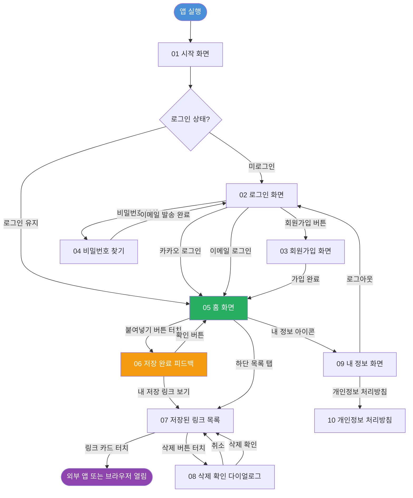
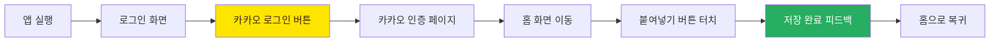
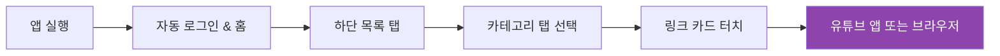
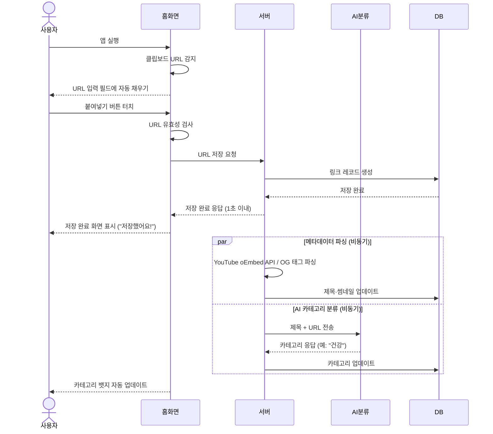
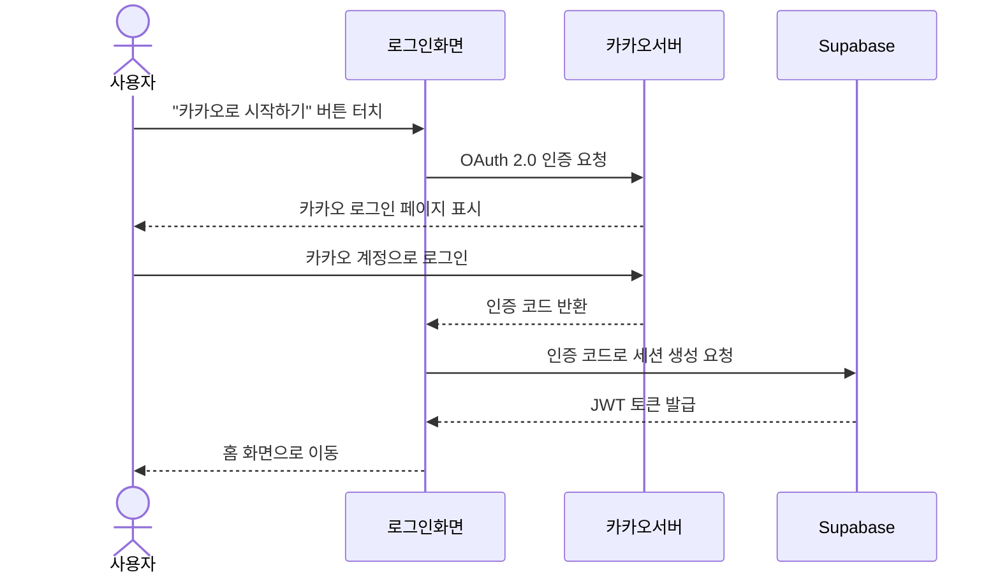
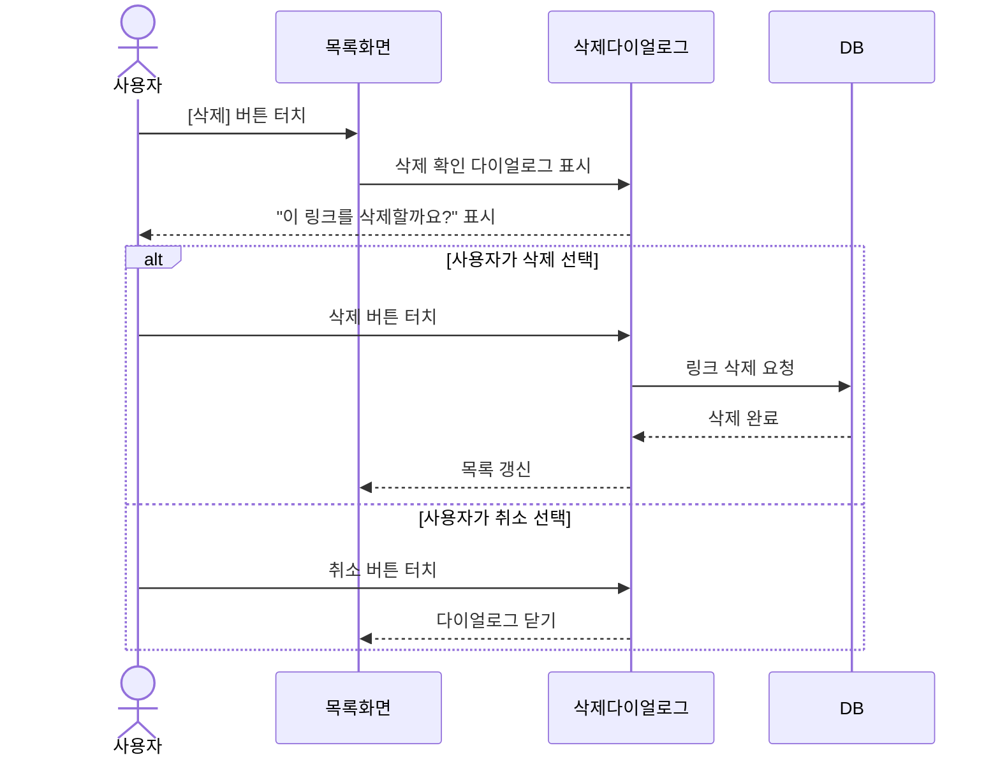

# 와이어프레임 & UX 플로우
생성일: 2026-03-01

---

## 1. 화면 목록 (스크린 인벤토리)

### 1.1 전체 화면 계층 구조

```
링크쏙 (LinkSock)
│
├── 인증 영역
│   ├── 01_시작 화면 (스플래시)
│   ├── 02_로그인 화면
│   ├── 03_회원가입 화면
│   │   ├── 03-1_이메일 입력
│   │   ├── 03-2_비밀번호 설정
│   │   └── 03-3_이메일 인증 안내
│   └── 04_비밀번호 찾기 화면
│
├── 메인 기능 영역
│   ├── 05_홈 화면 (링크 저장 메인)        ← 핵심 화면
│   ├── 06_저장 완료 피드백 화면            ← 핵심 화면
│   ├── 07_저장된 링크 목록 화면            ← 핵심 화면
│   │   ├── 07-1_전체 탭
│   │   ├── 07-2_건강 탭
│   │   ├── 07-3_요리·음식 탭
│   │   ├── 07-4_뉴스·시사 탭
│   │   ├── 07-5_종교·신앙 탭
│   │   ├── 07-6_여행·취미 탭
│   │   ├── 07-7_가족·생활 탭
│   │   └── 07-8_기타 탭
│   └── 08_링크 삭제 확인 다이얼로그
│
├── 설정 영역
│   ├── 09_내 정보 화면
│   └── 10_개인정보 처리방침 화면
│
└── 오류 상태 화면
    ├── 11_네트워크 오류 안내
    └── 12_빈 상태 (저장 링크 없음)
```

### 1.2 화면별 MVP 포함 여부

| 화면 번호 | 화면명 | MVP 포함 | 관련 기능 |
|-----------|--------|----------|-----------|
| 01 | 시작 화면 (스플래시) | O | - |
| 02 | 로그인 화면 | O | F05 |
| 03 | 회원가입 화면 | O | F05 |
| 04 | 비밀번호 찾기 | O | F05 |
| 05 | 홈 화면 (링크 저장 메인) | O | F01, F02, F03 |
| 06 | 저장 완료 피드백 화면 | O | F01 |
| 07 | 저장된 링크 목록 화면 | O | F04, F07 |
| 08 | 링크 삭제 확인 다이얼로그 | O | F07 |
| 09 | 내 정보 화면 | O | F05 |
| 10 | 개인정보 처리방침 | O (링크) | - |
| 11 | 네트워크 오류 안내 | O | - |
| 12 | 빈 상태 화면 | O | F04 |

---

## 2. 네비게이션 플로우

### 2.1 전체 화면 이동 흐름



### 2.2 핵심 사용 시나리오별 플로우

#### 시나리오 A: 처음 사용자 - 카카오 로그인 후 첫 링크 저장



#### 시나리오 B: 재방문 사용자 - 저장된 링크 찾아보기



---

## 3. 핵심 화면 와이어프레임 (ASCII 아트)

> 기준 해상도: 375px 너비, 812px 높이 (iPhone SE 기준)
> 모든 폰트 최소 18px, 버튼 최소 높이 44px

---

### 화면 02: 로그인 화면

**목적**: 이메일 또는 카카오 계정으로 로그인하여 서비스를 시작한다. 노인 사용자가 카카오 계정으로 빠르게 시작할 수 있도록 카카오 로그인 버튼을 최우선으로 배치한다.

```
┌─────────────────────────────┐
│                             │  상단 여백 48px
│                             │
│       링크쏙               │  앱 로고 (중앙 정렬)
│    [로고 이미지 72x72]      │  폰트: 28px Bold
│                             │
│  받은 링크를 모아보세요      │  설명 문구 20px
│                             │
│ ┌─────────────────────────┐ │
│ │  카카오로 시작하기      │ │  카카오 로그인 버튼
│ │  [카카오 아이콘]        │ │  높이: 56px / 배경: #FEE500
│ └─────────────────────────┘ │  폰트: 20px Bold / 색: #3C1E1E
│                             │
│  ─────── 또는 ───────       │  구분선 + 텍스트 (회색)
│                             │
│ ┌─────────────────────────┐ │
│ │  이메일 주소            │ │  이메일 입력 필드
│ └─────────────────────────┘ │  높이: 56px / 폰트: 18px
│                             │
│ ┌─────────────────────────┐ │
│ │  비밀번호               │ │  비밀번호 입력 필드
│ └─────────────────────────┘ │  높이: 56px / 폰트: 18px
│                             │
│  [비밀번호를 잊으셨나요?]    │  우측 정렬 / 18px / 링크
│                             │
│ ┌─────────────────────────┐ │
│ │       로그인            │ │  로그인 버튼
│ └─────────────────────────┘ │  높이: 56px / 배경: #2563EB
│                             │  폰트: 20px Bold / 색: #fff
│                             │
│  처음이세요?  [회원가입]    │  회원가입 유도 / 20px
│                             │
└─────────────────────────────┘

[인터랙션 포인트]
- 카카오 로그인 버튼: 카카오 OAuth 팝업 또는 리다이렉트
- 이메일/비밀번호 입력 필드: 소프트 키보드 활성화
- 비밀번호를 잊으셨나요: 비밀번호 찾기 화면 이동
- 로그인 버튼: 입력값 검증 후 로그인 처리
- 회원가입: 회원가입 화면 이동
```

**핵심 UI 컴포넌트**
- 카카오 로그인 버튼: 카카오 공식 브랜드 가이드 준수 (#FEE500 배경, 아이콘 필수 포함)
- 입력 필드: 테두리 2px, 포커스 시 파란색 강조, 최소 터치 영역 56px 높이
- 로그인 버튼: 전체 너비, 파란색(#2563EB), 비활성 상태는 회색
- 에러 메시지: 입력 필드 아래 빨간 텍스트 (18px), 진동 피드백

---

### 화면 03: 회원가입 화면

**목적**: 이메일과 비밀번호로 새 계정을 만든다. 비밀번호 규칙 안내를 쉬운 말로 제공한다.

```
┌─────────────────────────────┐
│  [< 뒤로]    회원가입        │  상단 내비게이션 바 56px
├─────────────────────────────┤
│                             │
│  이메일 주소를 입력해 주세요 │  안내 문구 / 22px Bold
│                             │
│ ┌─────────────────────────┐ │
│ │  이메일 주소            │ │  이메일 입력 필드
│ └─────────────────────────┘ │  높이: 56px
│                             │
│  비밀번호를 만들어 주세요    │  안내 문구 / 22px Bold
│  (영어와 숫자를 섞어서      │  보조 안내 / 18px / 회색
│   8자 이상 입력해 주세요)    │
│                             │
│ ┌─────────────────────────┐ │
│ │  비밀번호               │ │  비밀번호 입력 필드
│ └─────────────────────────┘ │  높이: 56px
│                             │
│ ┌─────────────────────────┐ │
│ │  비밀번호 확인          │ │  비밀번호 확인 입력 필드
│ └─────────────────────────┘ │  높이: 56px
│                             │
│ [V] 개인정보 처리방침에     │  체크박스 (44x44px)
│     동의합니다 [보기]       │  폰트: 18px / [보기]는 링크
│                             │
│ ┌─────────────────────────┐ │
│ │       가입 완료         │ │  가입 완료 버튼
│ └─────────────────────────┘ │  높이: 56px / 배경: #2563EB
│                             │
└─────────────────────────────┘

[인터랙션 포인트]
- 뒤로 버튼: 로그인 화면으로 복귀
- 이메일 입력: 형식 오류 시 실시간 안내 ("@ 기호를 포함해 주세요")
- 비밀번호 강도 표시: 입력 중 약함/보통/강함 시각 표시
- 개인정보 처리방침 [보기]: 하단 시트 또는 새 화면으로 전문 표시
- 가입 완료 버튼: 이메일 인증 발송 후 안내 화면으로 이동
```

**핵심 UI 컴포넌트**
- 체크박스: 최소 44x44px 터치 영역 확보 (아이콘은 24x24px이더라도 터치 영역 확장)
- 비밀번호 가시성 토글: 눈 모양 아이콘 (44x44px), 입력 내용 확인용
- 진행 상태 표시: 불필요 (단일 화면 회원가입)

---

### 화면 05: 홈 화면 (링크 저장 메인)

**목적**: 서비스의 핵심 화면. 클립보드에 복사된 링크를 붙여넣기 버튼 한 번으로 저장한다. 노인 사용자가 앱을 열었을 때 무엇을 해야 하는지 즉시 이해할 수 있도록 설계한다.

```
┌─────────────────────────────┐
│  링크쏙             [내정보]│  상단 바 56px
│                      (24px) │  앱명: 24px Bold / 파란색
├─────────────────────────────┤
│                             │
│  ┌───────────────────────┐  │
│  │                       │  │  URL 입력 필드
│  │  복사한 링크가 여기에  │  │  높이: 72px
│  │  자동으로 채워져요     │  │  폰트: 18px / 회색 플레이스홀더
│  │                [X]    │  │  [X]: 지우기 버튼 (44x44px)
│  └───────────────────────┘  │  테두리: 2px 파란색
│                             │
│                             │  여백 32px
│                             │
│  ┌───────────────────────┐  │
│  │                       │  │  붙여넣기 버튼 (핵심 버튼)
│  │  여기에 링크 붙여넣기  │  │  높이: 72px
│  │        [붙여넣기]      │  │  폰트: 22px Bold / 흰색
│  │                       │  │  배경: #2563EB (진한 파란색)
│  └───────────────────────┘  │  모서리 둥글게 (12px radius)
│                             │
│                             │  여백 16px
│                             │
│  💡 사용법                  │  안내 섹션 제목 / 20px Bold
│                             │
│  ① 카카오톡에서 링크를      │
│     꾹 눌러 복사하세요      │  안내 문구 / 18px / 행간 28px
│                             │
│  ② 이 버튼을 눌러          │
│     저장하세요              │
│                             │
│  ③ 나중에 탭에서           │
│     다시 볼 수 있어요       │
│                             │
├─────────────────────────────┤
│  [저장]       [내 링크]     │  하단 내비게이션 바 60px
│  (홈 아이콘)  (목록 아이콘) │  아이콘: 28px / 레이블: 14px
└─────────────────────────────┘

[인터랙션 포인트]
- URL 입력 필드: 앱 진입 시 클립보드 감지 → URL이 있으면 자동 채우기
- 붙여넣기 버튼: 클립보드에서 URL 가져와 저장 처리 시작
- [X] 지우기 버튼: 입력 필드 내용 초기화
- 하단 [내 링크] 탭: 저장된 링크 목록 화면으로 이동
```

**핵심 UI 컴포넌트**
- URL 입력 필드: 높이 72px (노인 터치 정확도 고려), 파란 테두리로 포커스 강조
- 붙여넣기 버튼: 화면에서 가장 크고 눈에 띄는 요소, 높이 72px, 진한 파란색
- 사용법 안내: 번호 목록으로 3단계만 표시, 아이콘 없이 텍스트로만 (해석 오류 방지)
- 하단 내비게이션: 아이콘 + 텍스트 레이블 병행 (아이콘만으로는 노인 사용자 이해 어려움)

---

### 화면 06: 저장 완료 피드백 화면

**목적**: 링크가 성공적으로 저장되었음을 시각적, 텍스트로 명확히 알린다. 노인 사용자의 불안감("제대로 저장된 건가요?")을 해소하는 핵심 화면이다.

```
┌─────────────────────────────┐
│                             │
│                             │  상단 여백 64px
│                             │
│           ✓                 │  체크 아이콘 (초록색, 96px)
│                             │
│       저장했어요!            │  메인 메시지 / 32px Bold
│                             │  색: #27AE60 (초록색)
│                             │
│  ┌───────────────────────┐  │
│  │   [썸네일 이미지]     │  │  저장된 링크 썸네일
│  │   320 x 180px         │  │  (전체 너비 기준)
│  └───────────────────────┘  │
│                             │
│  [건강] 카테고리에 저장됐어요 │  카테고리 뱃지 + 안내 문구
│                             │  뱃지: 초록 배경 흰 글씨
│  아직 분류 중이에요...       │  (AI 분류 중인 경우 대체 표시)
│                             │
│  운동으로 건강 지키는 5가지  │  링크 제목 / 20px / 2줄까지
│  방법 - 건강TV              │  이하 말줄임
│                             │
│                             │  여백 32px
│                             │
│ ┌─────────────────────────┐ │
│ │        확인              │ │  확인 버튼 → 홈 화면으로
│ └─────────────────────────┘ │  높이: 60px / 배경: #2563EB
│                             │  폰트: 22px Bold
│                             │
│ ┌─────────────────────────┐ │
│ │    내 저장 링크 보기    │ │  보조 버튼 → 링크 목록으로
│ └─────────────────────────┘ │  높이: 56px / 배경: 흰색
│                             │  폰트: 20px / 테두리: #2563EB
└─────────────────────────────┘

[인터랙션 포인트]
- 화면 진입 시: 성공 애니메이션 (체크 아이콘 등장, 0.5초)
- AI 분류 진행 중: "분류 중이에요..." 텍스트 + 로딩 점 애니메이션
- AI 분류 완료 시: 카테고리 뱃지 자동 업데이트 (페이드 인)
- 확인 버튼: 홈 화면으로 이동
- 내 저장 링크 보기: 링크 목록 화면으로 이동
```

**핵심 UI 컴포넌트**
- 체크 아이콘: 96px, 초록색 (#27AE60), 등장 애니메이션 포함
- "저장했어요!" 텍스트: 32px Bold, 가장 큰 텍스트 요소 (성공 신호 극대화)
- 썸네일: 전체 너비 이미지 (320x180px), 파싱 실패 시 회색 플레이스홀더
- 카테고리 뱃지: 초록 배경, 흰 글씨, 20px, 둥근 모서리
- 확인 버튼 2개: 주요 액션(홈)과 보조 액션(목록) 명확히 구분

---

### 화면 07: 저장된 링크 목록 화면

**목적**: 저장된 링크를 카테고리별 탭으로 분류해 보여준다. 큰 썸네일과 제목으로 노인 사용자가 원하는 콘텐츠를 빠르게 찾아 열 수 있다.

```
┌─────────────────────────────┐
│  내 저장 링크       [내정보]│  상단 바 56px
├─────────────────────────────┤
│                             │  카테고리 탭 영역
│ ┌──┐┌──┐┌──┐┌──┐┌──┐┌──┐  │  가로 스크롤 / 탭 높이 48px
│ │전체││건강││요리││뉴스││종교││여행│  │  선택 탭: 파란 밑줄 + 볼드
│ └──┘└──┘└──┘└──┘└──┘└──┘  │  미선택: 회색 텍스트
│   ▶ 가로 스크롤 (더 있어요) │  폰트: 18px
├─────────────────────────────┤
│                             │
│  총 12개 저장됨             │  저장 개수 안내 / 18px / 회색
│                             │
│ ┌─────────────────────────┐ │
│ │ ┌─────────────────────┐ │ │  링크 카드 (전체 너비)
│ │ │   [썸네일 이미지]   │ │ │  썸네일: 전체 너비 x 200px
│ │ │   375 x 200px       │ │ │
│ │ └─────────────────────┘ │ │
│ │                         │ │
│ │  [건강]  2025.03.01     │ │  카테고리 뱃지 + 날짜 / 16px
│ │                         │ │
│ │  운동으로 건강 지키는   │ │  제목 / 20px Bold / 최대 2줄
│ │  5가지 방법 - 건강TV    │ │
│ │                         │ │
│ │                [삭제]   │ │  삭제 버튼 / 44px x 44px
│ └─────────────────────────┘ │  우측 하단 / 텍스트: 18px / 빨간색
│                             │
│ ┌─────────────────────────┐ │
│ │ ┌─────────────────────┐ │ │  두 번째 링크 카드
│ │ │   [썸네일 이미지]   │ │ │
│ │ │   375 x 200px       │ │ │
│ │ └─────────────────────┘ │ │
│ │                         │ │
│ │  [뉴스]  2025.02.28     │ │
│ │                         │ │
│ │  오늘의 주요 뉴스 정리  │ │
│ │                         │ │
│ │                [삭제]   │ │
│ └─────────────────────────┘ │
│                             │
│      ↕ 위아래 스크롤        │  스크롤 영역
│                             │
├─────────────────────────────┤
│  [저장]       [내 링크]     │  하단 내비게이션 60px
│  (홈 아이콘)  (목록 아이콘) │  현재 탭: 파란색 강조
└─────────────────────────────┘

[인터랙션 포인트]
- 카테고리 탭: 탭 선택 시 해당 카테고리 링크만 표시 (필터링)
- 탭 가로 스크롤: 스와이프로 가족·생활, 기타 탭까지 접근
- 링크 카드 터치: 외부 앱(유튜브 앱) 또는 브라우저로 딥링크 이동
- [삭제] 버튼: 삭제 확인 다이얼로그 (화면 08) 표시
- 목록 아래로 스크롤: 더 많은 저장 링크 표시 (무한 스크롤 또는 페이지네이션)
```

**핵심 UI 컴포넌트**
- 카테고리 탭: 높이 48px, 가로 스크롤 처리, 선택 탭 파란 밑줄 (2px)
- 링크 카드: 전체 너비, 상단 이미지 (375x200px), 카드 사이 간격 16px
- 썸네일: 실패 시 회색 플레이스홀더 ("이미지를 가져오지 못했어요")
- 카테고리 뱃지: 색상별 구분 (건강: 초록, 뉴스: 파랑, 요리: 주황 등)
- 삭제 버튼: 빨간 텍스트, 카드 우측 하단, 충분한 간격으로 실수 터치 방지

---

### 화면 08: 링크 삭제 확인 다이얼로그

**목적**: 삭제는 되돌릴 수 없으므로, 노인 사용자가 실수로 삭제하지 않도록 반드시 확인 단계를 제공한다.

```
┌─────────────────────────────┐
│                             │
│  (배경: 반투명 어둡게)       │  오버레이 배경
│                             │
│   ┌─────────────────────┐   │
│   │                     │   │
│   │   이 링크를         │   │  다이얼로그 제목 / 22px Bold
│   │   삭제할까요?       │   │  중앙 정렬
│   │                     │   │
│   │  삭제하면 다시      │   │  안내 문구 / 18px / 회색
│   │  복구하기 어렵습니다│   │
│   │                     │   │
│   │ ┌───────┐ ┌───────┐ │   │
│   │ │  취소  │ │  삭제  │ │   │  버튼 2개 / 각 높이 52px
│   │ └───────┘ └───────┘ │   │  취소: 회색 배경 / 삭제: 빨간 배경
│   │ (흰 배경) (빨간 배경)│   │  폰트: 20px Bold
│   │                     │   │
│   └─────────────────────┘   │  다이얼로그 모서리 둥글게 (16px)
│                             │
└─────────────────────────────┘

[인터랙션 포인트]
- 취소 버튼: 다이얼로그 닫기, 링크 목록 유지
- 삭제 버튼: 링크 삭제 처리 → 목록에서 즉시 제거
- 배경 터치: 취소와 동일 (닫기)
- 삭제 처리 중: 삭제 버튼 로딩 상태 표시
```

**핵심 UI 컴포넌트**
- 다이얼로그 너비: 화면 너비의 85% (약 320px)
- 버튼 높이: 52px (44px 이상 접근성 기준 충족)
- 삭제 버튼: 빨간색 (#DC2626), 취소 버튼과 시각적으로 확연히 구분
- 안내 문구: "복구하기 어렵습니다" 명시 (되돌릴 수 없음 명확히 전달)

---

### 화면 12: 빈 상태 화면 (저장 링크 없음)

**목적**: 처음 사용자 또는 특정 카테고리에 링크가 없을 때 사용자에게 다음 행동을 안내한다.

```
┌─────────────────────────────┐
│  내 저장 링크       [내정보]│  상단 바
├─────────────────────────────┤
│  전체  건강  요리  뉴스 ... │  카테고리 탭 (선택 상태 표시)
├─────────────────────────────┤
│                             │
│                             │  여백 80px
│                             │
│      [폴더 이미지 96px]     │  비어있는 폴더 일러스트
│                             │
│  아직 저장한 링크가 없어요   │  메인 안내 / 22px Bold / 중앙
│                             │
│  카카오톡에서 받은 링크를   │  보조 안내 / 18px / 회색 / 중앙
│  복사해서 저장해 보세요     │
│                             │
│                             │  여백 32px
│                             │
│ ┌─────────────────────────┐ │
│ │    링크 저장하러 가기   │ │  CTA 버튼 → 홈(저장) 화면으로
│ └─────────────────────────┘ │  높이: 56px / 배경: #2563EB
│                             │
└─────────────────────────────┘
```

---

## 4. 핵심 인터랙션 플로우 (Sequence Diagram)

### 4.1 링크 저장 전체 플로우



### 4.2 카카오 소셜 로그인 플로우



### 4.3 링크 삭제 플로우



---

## 5. 컴포넌트 설계 주요 사항

### 5.1 버튼 규격

| 버튼 유형 | 높이 | 폰트 크기 | 배경색 | 비고 |
|-----------|------|-----------|--------|------|
| 주요 액션 버튼 (로그인, 저장 등) | 56~72px | 20~22px Bold | #2563EB (파랑) | 전체 너비 |
| 보조 액션 버튼 (취소, 더보기 등) | 52~56px | 18~20px | 흰색 + 테두리 | 전체 너비 |
| 카카오 로그인 버튼 | 56px | 20px Bold | #FEE500 (노란색) | 카카오 브랜드 가이드 준수 |
| 삭제 버튼 (인라인) | 44px | 18px | 흰색 | 빨간 텍스트 (#DC2626) |
| 카테고리 탭 버튼 | 48px | 18px | 흰색 / 선택 시 파란 밑줄 | 가로 스크롤 |
| 아이콘 버튼 (닫기, 뒤로가기 등) | 44x44px | - | 투명 | 터치 영역 최소 44x44px 필수 |

### 5.2 타이포그래피 규격

| 요소 | 폰트 크기 | 굵기 | 색상 | 비고 |
|------|-----------|------|------|------|
| 화면 제목 | 24~28px | Bold | #111827 | 상단 바 |
| 섹션 제목 | 22px | Bold | #111827 | |
| 주요 안내 문구 | 20~22px | Bold | #111827 | 핵심 액션 설명 |
| 본문 텍스트 | 18~20px | Regular | #374151 | 링크 제목, 설명 등 |
| 보조 텍스트 | 16~18px | Regular | #6B7280 (회색) | 날짜, 도메인 등 |
| 에러 메시지 | 18px | Regular | #DC2626 (빨강) | 입력 오류 등 |
| 버튼 레이블 | 18~22px | Bold | 버튼 색상에 따라 | |

> 최소 폰트 크기 기준: **18px** (본문), **16px** (보조 정보 최소값)

### 5.3 간격 및 여백 규격

| 요소 | 규격 | 비고 |
|------|------|------|
| 화면 좌우 여백 | 20px | 전체 콘텐츠 기준 |
| 카드 사이 세로 간격 | 16px | 링크 목록 카드 사이 |
| 섹션 간 간격 | 32px | 화면 내 섹션 구분 |
| 입력 필드 내부 여백 | 16px (좌우) | |
| 버튼 내부 여백 | 16px (좌우) | |

### 5.4 썸네일 규격

| 유형 | 크기 | 비고 |
|------|------|------|
| 링크 목록 카드 썸네일 | 375x200px (전체 너비 기준) | 16:9 비율 권장 |
| 저장 완료 화면 썸네일 | 375x200px (전체 너비 기준) | |
| 썸네일 실패 플레이스홀더 | 동일 크기, 회색 배경 | "이미지를 가져오지 못했어요" 텍스트 |

### 5.5 색상 활용 원칙

| 용도 | 색상 코드 | 사용처 |
|------|-----------|--------|
| 주요 액션 | #2563EB | 주요 버튼, 탭 강조, 입력 필드 포커스 |
| 성공 상태 | #27AE60 | 저장 완료, 체크 아이콘, 건강 카테고리 뱃지 |
| 경고·삭제 | #DC2626 | 삭제 버튼, 에러 메시지 |
| 카카오 | #FEE500 | 카카오 로그인 버튼 전용 |
| 배경 | #F9FAFB | 화면 배경 (순백보다 눈의 피로 감소) |
| 텍스트 기본 | #111827 | 제목, 주요 텍스트 |
| 텍스트 보조 | #6B7280 | 날짜, 설명, 비활성 탭 |

### 5.6 접근성 체크리스트

| 항목 | 기준 | 대응 방안 |
|------|------|-----------|
| 최소 터치 영역 | 44 x 44px 이상 | 모든 버튼 및 아이콘 터치 영역 확보 |
| 색상 대비 | WCAG AA (4.5:1 이상) | 파란색 버튼 위 흰 텍스트: 약 7.0:1 충족 |
| 폰트 크기 | 본문 최소 18px | 시스템 폰트 크기 설정 변경 시에도 유지 |
| 에러 표현 | 색상 + 텍스트 병행 | 빨간 테두리만이 아니라 에러 문구 텍스트 필수 |
| 빈 상태 처리 | 안내 문구 필수 | 아이콘만 표시 금지, 행동 안내 포함 |
| 로딩 상태 | 로딩 인디케이터 + 텍스트 | "불러오는 중...", "분류 중이에요..." 표시 |
| 스크린 리더 | 핵심 버튼 aria-label 제공 | 붙여넣기, 저장, 삭제, 로그인 버튼 |

---

## 6. 디자인 가이드라인 제안

### 6.1 추천 색상 팔레트

| 구분 | 색상 | 코드 | 사용 목적 |
|------|------|------|-----------|
| 주색 | 중간 파란색 | #2563EB | 버튼, 강조, 링크, 탭 |
| 주색 어두운 버전 | 어두운 파란색 | #1D4ED8 | 버튼 호버 또는 누름 상태 |
| 보조색 1 (성공) | 초록색 | #27AE60 | 저장 완료, 성공 상태 |
| 보조색 2 (경고) | 빨간색 | #DC2626 | 삭제, 에러 |
| 카카오 | 노란색 | #FEE500 | 카카오 로그인 버튼 전용 |
| 배경 | 매우 연한 회색 | #F9FAFB | 화면 전체 배경 |
| 카드 배경 | 흰색 | #FFFFFF | 링크 카드 배경 |
| 텍스트 기본 | 거의 검정 | #111827 | 제목, 주요 내용 |
| 텍스트 보조 | 중간 회색 | #6B7280 | 날짜, 설명, 비활성 요소 |
| 구분선 | 연한 회색 | #E5E7EB | 섹션 구분선 |

**카테고리별 뱃지 색상 (선택 제안)**

| 카테고리 | 배경색 | 텍스트 |
|----------|--------|--------|
| 건강 | #D1FAE5 | #065F46 |
| 요리·음식 | #FEF3C7 | #92400E |
| 뉴스·시사 | #DBEAFE | #1E40AF |
| 종교·신앙 | #EDE9FE | #5B21B6 |
| 여행·취미 | #FFE4E6 | #9F1239 |
| 가족·생활 | #FEE2E2 | #991B1B |
| 기타 | #F3F4F6 | #374151 |

### 6.2 타이포그래피 방향

- **기본 폰트**: 시스템 기본 폰트 우선 사용 (iOS: San Francisco, Android: Noto Sans KR)
- **웹 폰트 사용 시**: Noto Sans KR (Google Fonts) 권장. 한글 가독성 우수, 가볍고 무료
- **폰트 굵기 활용**:
  - 중요한 정보(버튼, 제목): Bold (700)
  - 일반 본문: Regular (400)
  - 날짜, 보조 설명: Light (300) 또는 Regular (400)
- **행간 (Line Height)**: 본문 1.6 이상. 한글은 영어보다 행간이 넓어야 가독성 확보
- **자간**: 기본값 사용. 불필요한 자간 조정 금지 (가독성 저해 위험)

### 6.3 전반적인 톤앤매너

**핵심 키워드**: 따뜻함, 신뢰감, 단순함, 명확함

- **따뜻하고 친근한 느낌**: "저장했어요!", "아직 저장한 링크가 없어요" 등 구어체 안내 문구 사용. 딱딱한 기술 용어 배제
- **신뢰감 있는 색상**: 파란색 계열 주색 (신뢰·안정을 상징). 과도한 화려함 없이 깔끔하게
- **충분한 여백**: 요소들 간 간격을 여유 있게 설정해 화면이 복잡하지 않게 유지
- **아이콘 최소화**: 아이콘은 반드시 텍스트 레이블과 함께 사용. 아이콘만 있는 버튼 지양
- **피드백 명확화**: 모든 액션(저장, 삭제, 로그인)에 성공 또는 실패 피드백 필수. "됐나요?"의 불확실감 제거
- **단계 수 최소화**: 어떤 기능이든 3단계 이상 조작 필요한 경우 UX 재설계 검토

---

*본 문서는 링크쏙(LinkSock) PRD 및 MVP 스코핑을 기반으로 작성된 와이어프레임 및 UX 플로우 설계서입니다.*
*대상 플랫폼: 모바일 웹 (375~428px 너비), 노인·중장년층 접근성 최우선 적용*
