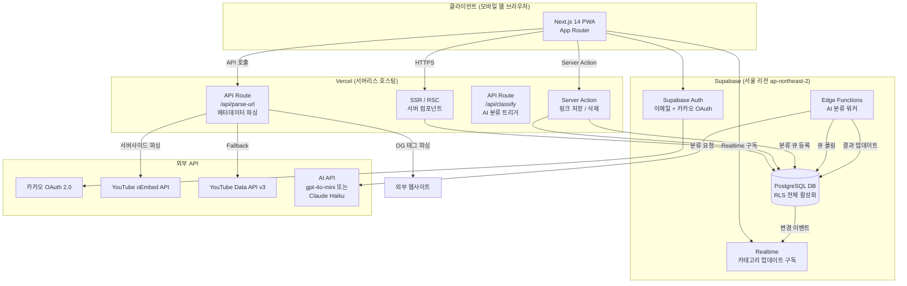

# 기술 스펙 문서
생성일: 2026-03-01

---

## 1. 시스템 아키텍처

### 1.1 전체 아키텍처 개요



### 1.2 주요 컴포넌트와 역할

| 컴포넌트 | 역할 | 기술 |
|----------|------|------|
| Next.js App Router | 페이지 라우팅, SSR/RSC, Server Action | Next.js 14 |
| Supabase Auth | 이메일 및 카카오 소셜 인증, JWT 세션 관리 | Supabase Auth |
| PostgreSQL (Supabase) | 링크·사용자 데이터 영구 저장, RLS 적용 | PostgreSQL 15 |
| Supabase Edge Function | AI 분류 비동기 워커 (큐 소비) | Deno 런타임 |
| Supabase Realtime | 카테고리 분류 완료 시 클라이언트 실시간 업데이트 | WebSocket |
| Vercel API Route | URL 메타데이터 파싱 (서버사이드 CORS 우회) | Node.js 서버리스 |
| AI API | URL+제목 기반 7개 카테고리 분류 | gpt-4o-mini 또는 Claude Haiku |

### 1.3 데이터 흐름

#### 링크 저장 플로우

```
사용자 클립보드 복사
       │
       ▼
[Client] 붙여넣기 버튼 클릭
       │
       ▼
[Server Action] URL 유효성 검사 + 일일 저장 한도(20개) 확인
       │
       ├── 한도 초과 → 에러 응답 반환
       │
       ▼
[Supabase DB] links 테이블에 레코드 삽입 (status: "pending")
       │
       ├──────────────────────┐
       ▼                      ▼
[Client] "저장했어요!" 표시    [API Route /api/parse-url]
                              URL 메타데이터 파싱
                              (oEmbed → OG 태그 → Fallback)
                                     │
                                     ▼
                              [Supabase DB] title, thumbnail 업데이트
                                     │
                                     ▼
                              [classification_queue] 분류 작업 등록
                                     │
                                     ▼
                              [Supabase Edge Function] AI API 호출
                              gpt-4o-mini / Claude Haiku
                                     │
                                     ▼
                              [Supabase DB] category 업데이트
                                     │
                                     ▼
                              [Realtime] 클라이언트에 변경 이벤트 푸시
                                     │
                                     ▼
                              [Client] 카테고리 뱃지 자동 갱신
```

---

## 2. 기술 스택 선정

| 영역 | 기술 | 버전 | 선택 이유 |
|------|------|------|-----------|
| Frontend Framework | Next.js (App Router) | 14.x | SSR/RSC로 초기 로딩 최적화, Server Action으로 클라이언트-서버 경계 단순화. Vercel과의 완벽한 통합. 1인 개발에 적합한 풀스택 프레임워크 |
| UI 스타일링 | Tailwind CSS | 3.x | 유틸리티 클래스로 빠른 시니어 최적화 UI 구현 (폰트 크기, 터치 영역). 별도 CSS 파일 관리 불필요 |
| 상태 관리 | Zustand | 4.x | React Query와 병행. 클라이언트 전역 상태(카테고리 필터 등) 관리. Redux 대비 보일러플레이트 최소화 |
| 서버 상태 관리 | TanStack Query (React Query) | 5.x | 링크 목록 캐싱·갱신·페이지네이션 처리. Supabase Realtime 이벤트와 연동하여 캐시 무효화 |
| Backend-as-a-Service | Supabase | - | PostgreSQL + Auth + Realtime + Edge Functions + Storage를 하나의 플랫폼에서 제공. 서울 리전(ap-northeast-2) 지원. 1인 개발자 운영 비용 최소화. RLS로 행 수준 보안 구현 용이 |
| Database | PostgreSQL (Supabase 관리형) | 15.x | JSONB 컬럼으로 메타데이터 유연 저장. RLS 정책 지원. Supabase MCP를 통한 직접 쿼리 가능 |
| 인증 | Supabase Auth | - | 이메일 인증 + 카카오 OAuth 2.0 내장 지원. JWT 자동 갱신. 별도 인증 서버 구현 불필요 |
| 서버리스 워커 | Supabase Edge Function | - | AI 분류 비동기 처리에 최적화. Deno 런타임으로 빠른 콜드스타트. Vercel 서버리스 10초 제한 우회 |
| 실시간 통신 | Supabase Realtime | - | DB 변경 이벤트를 WebSocket으로 클라이언트에 전달. 카테고리 분류 완료 알림에 활용 |
| AI 카테고리 분류 | gpt-4o-mini (우선) | - | 입력 토큰당 $0.15/1M, 출력 토큰당 $0.60/1M. 링크당 약 200 토큰 소모 시 MAU 1000명 기준 월 $5~10 예상. Claude Haiku와 A/B 테스트 후 한국어 정확도 기준 선정 |
| 메타데이터 파싱 | cheerio + node-fetch | - | 서버사이드에서 OG 태그 파싱. CORS 제약 없이 외부 URL 접근 가능 |
| 인프라/배포 | Vercel | - | Next.js 공식 배포 플랫폼. 자동 CDN, HTTPS, 도메인 관리. 무료 플랜으로 MVP 운영 가능 |
| 에러 모니터링 | Sentry | - | 프론트엔드/서버 에러 실시간 알림. 링크 저장 실패율 추적. 무료 플랜(5K 에러/월)으로 시작 |
| 분석 | Vercel Analytics | - | 재방문율, 페이지뷰 추적. 별도 설정 없이 Next.js에서 활성화 |
| 외부 유튜브 연동 | YouTube oEmbed API | - | API 키 불필요. 무료. 유튜브 영상 제목·썸네일 취득 |

---

## 3. 데이터베이스 스키마

### 3.1 테이블 정의

#### users (사용자 프로필)

```sql
CREATE TABLE users (
  id           UUID PRIMARY KEY DEFAULT auth.uid(),
  email        TEXT UNIQUE,
  display_name TEXT,
  avatar_url   TEXT,
  provider     TEXT NOT NULL DEFAULT 'email',   -- 'email' | 'kakao'
  created_at   TIMESTAMPTZ NOT NULL DEFAULT now(),
  updated_at   TIMESTAMPTZ NOT NULL DEFAULT now()
);

-- Supabase Auth와 연동: auth.users와 1:1 관계
-- 가입 시 트리거로 자동 생성
```

#### links (저장된 링크)

```sql
CREATE TABLE links (
  id              UUID PRIMARY KEY DEFAULT gen_random_uuid(),
  user_id         UUID NOT NULL REFERENCES users(id) ON DELETE CASCADE,
  url             TEXT NOT NULL,
  title           TEXT,                           -- 메타데이터 파싱 결과 (최대 200자)
  thumbnail_url   TEXT,                           -- OG image 또는 YouTube 썸네일
  domain          TEXT,                           -- 도메인명 (예: youtube.com)
  link_type       TEXT NOT NULL DEFAULT 'general', -- 'youtube' | 'general'
  category        TEXT NOT NULL DEFAULT 'pending', -- '건강'|'요리·음식'|'뉴스·시사'|'종교·신앙'|'여행·취미'|'가족·생활'|'기타'|'pending'
  category_source TEXT NOT NULL DEFAULT 'pending', -- 'ai' | 'user' | 'pending' | 'failed'
  metadata        JSONB,                          -- 추가 메타데이터 (og:description 등)
  created_at      TIMESTAMPTZ NOT NULL DEFAULT now(),
  updated_at      TIMESTAMPTZ NOT NULL DEFAULT now()
);
```

#### classification_queue (AI 분류 작업 큐)

```sql
CREATE TABLE classification_queue (
  id          UUID PRIMARY KEY DEFAULT gen_random_uuid(),
  link_id     UUID NOT NULL REFERENCES links(id) ON DELETE CASCADE,
  status      TEXT NOT NULL DEFAULT 'waiting',  -- 'waiting' | 'processing' | 'done' | 'failed'
  attempts    INT NOT NULL DEFAULT 0,
  error_msg   TEXT,
  created_at  TIMESTAMPTZ NOT NULL DEFAULT now(),
  processed_at TIMESTAMPTZ
);
```

#### daily_save_counts (일일 저장 횟수 카운터)

```sql
CREATE TABLE daily_save_counts (
  user_id    UUID NOT NULL REFERENCES users(id) ON DELETE CASCADE,
  save_date  DATE NOT NULL DEFAULT CURRENT_DATE,
  count      INT NOT NULL DEFAULT 0,
  PRIMARY KEY (user_id, save_date)
);
```

### 3.2 인덱스 전략

```sql
-- links 테이블: 사용자별 링크 목록 조회 (카테고리 필터 포함)
CREATE INDEX idx_links_user_created ON links (user_id, created_at DESC);
CREATE INDEX idx_links_user_category ON links (user_id, category);

-- links 테이블: 중복 URL 체크 (사용자 범위 내)
CREATE UNIQUE INDEX idx_links_user_url ON links (user_id, url);

-- classification_queue: 대기 중인 작업 폴링
CREATE INDEX idx_queue_status ON classification_queue (status, created_at ASC)
  WHERE status = 'waiting';

-- daily_save_counts: 일일 한도 확인
-- (user_id, save_date) PK가 인덱스 역할 수행
```

### 3.3 Supabase RLS 정책

#### users 테이블

```sql
ALTER TABLE users ENABLE ROW LEVEL SECURITY;

-- 자신의 프로필만 조회 가능
CREATE POLICY "users_select_own"
  ON users FOR SELECT
  USING (auth.uid() = id);

-- 자신의 프로필만 수정 가능
CREATE POLICY "users_update_own"
  ON users FOR UPDATE
  USING (auth.uid() = id);

-- 가입 시 본인 레코드 삽입 가능
CREATE POLICY "users_insert_own"
  ON users FOR INSERT
  WITH CHECK (auth.uid() = id);
```

#### links 테이블

```sql
ALTER TABLE links ENABLE ROW LEVEL SECURITY;

-- 자신이 저장한 링크만 조회 가능
CREATE POLICY "links_select_own"
  ON links FOR SELECT
  USING (auth.uid() = user_id);

-- 본인 링크만 삽입 가능
CREATE POLICY "links_insert_own"
  ON links FOR INSERT
  WITH CHECK (auth.uid() = user_id);

-- 본인 링크만 수정 가능 (카테고리 수동 변경)
CREATE POLICY "links_update_own"
  ON links FOR UPDATE
  USING (auth.uid() = user_id);

-- 본인 링크만 삭제 가능
CREATE POLICY "links_delete_own"
  ON links FOR DELETE
  USING (auth.uid() = user_id);
```

#### classification_queue 테이블

```sql
ALTER TABLE classification_queue ENABLE ROW LEVEL SECURITY;

-- 일반 사용자 접근 불가 (서비스 롤 키로만 Edge Function이 접근)
-- 클라이언트에서 직접 접근 차단
CREATE POLICY "queue_deny_client"
  ON classification_queue FOR ALL
  USING (false);
```

#### daily_save_counts 테이블

```sql
ALTER TABLE daily_save_counts ENABLE ROW LEVEL SECURITY;

-- 본인 카운트만 조회 가능
CREATE POLICY "daily_counts_select_own"
  ON daily_save_counts FOR SELECT
  USING (auth.uid() = user_id);

-- 서버 측(Server Action)에서만 upsert (서비스 롤 키 사용)
-- 클라이언트 직접 조작 차단
CREATE POLICY "daily_counts_deny_client_write"
  ON daily_save_counts FOR INSERT
  USING (false);
```

### 3.4 트리거

```sql
-- users 테이블: auth.users 가입 시 자동 프로필 생성
CREATE OR REPLACE FUNCTION handle_new_user()
RETURNS TRIGGER LANGUAGE plpgsql SECURITY DEFINER AS $$
BEGIN
  INSERT INTO public.users (id, email, display_name, avatar_url, provider)
  VALUES (
    NEW.id,
    NEW.email,
    COALESCE(NEW.raw_user_meta_data->>'full_name', NEW.email),
    NEW.raw_user_meta_data->>'avatar_url',
    COALESCE(NEW.raw_user_meta_data->>'provider', 'email')
  )
  ON CONFLICT (id) DO NOTHING;
  RETURN NEW;
END;
$$;

CREATE TRIGGER on_auth_user_created
  AFTER INSERT ON auth.users
  FOR EACH ROW EXECUTE FUNCTION handle_new_user();

-- links 테이블: 저장 시 분류 큐에 자동 등록
CREATE OR REPLACE FUNCTION enqueue_classification()
RETURNS TRIGGER LANGUAGE plpgsql AS $$
BEGIN
  INSERT INTO classification_queue (link_id) VALUES (NEW.id);
  RETURN NEW;
END;
$$;

CREATE TRIGGER on_link_inserted
  AFTER INSERT ON links
  FOR EACH ROW EXECUTE FUNCTION enqueue_classification();

-- updated_at 자동 갱신 트리거 (links, users 공통)
CREATE OR REPLACE FUNCTION update_updated_at()
RETURNS TRIGGER LANGUAGE plpgsql AS $$
BEGIN
  NEW.updated_at = now();
  RETURN NEW;
END;
$$;

CREATE TRIGGER links_updated_at
  BEFORE UPDATE ON links
  FOR EACH ROW EXECUTE FUNCTION update_updated_at();
```

### 3.5 ERD (Entity Relationship Diagram)

```
auth.users (Supabase 관리)
    │ 1
    │ (트리거로 자동 생성)
    ▼ 1
  users
  ─────────────────
  id (PK, UUID)
  email
  display_name
  avatar_url
  provider
  created_at
  updated_at
    │ 1
    │
    ▼ N
   links
  ─────────────────
  id (PK, UUID)
  user_id (FK → users.id)
  url
  title
  thumbnail_url
  domain
  link_type
  category
  category_source
  metadata (JSONB)
  created_at
  updated_at
    │ 1
    │
    ▼ 1
  classification_queue
  ─────────────────
  id (PK, UUID)
  link_id (FK → links.id)
  status
  attempts
  error_msg
  created_at
  processed_at

  daily_save_counts
  ─────────────────
  user_id (PK, FK → users.id)
  save_date (PK, DATE)
  count
```

---

## 4. API 설계

### 4.1 링크 저장

```
POST /api/v1/links

Headers:
  Authorization: Bearer {supabase_jwt}
  Content-Type: application/json

Request:
{
  "url": "https://www.youtube.com/watch?v=xxxxx"
}

Response 201:
{
  "id": "uuid",
  "url": "https://www.youtube.com/watch?v=xxxxx",
  "title": null,
  "thumbnail_url": null,
  "category": "pending",
  "category_source": "pending",
  "created_at": "2026-03-01T17:59:08Z"
}

Response 400 (유효하지 않은 URL):
{
  "error": "INVALID_URL",
  "message": "올바른 링크가 아닙니다."
}

Response 409 (중복 URL):
{
  "error": "DUPLICATE_URL",
  "message": "이미 저장된 링크입니다.",
  "existing_id": "uuid"
}

Response 429 (일일 한도 초과):
{
  "error": "DAILY_LIMIT_EXCEEDED",
  "message": "오늘 저장할 수 있는 링크 수(20개)를 초과했습니다.",
  "reset_at": "2026-03-02T00:00:00Z"
}
```

### 4.2 링크 목록 조회

```
GET /api/v1/links?category={category}&cursor={cursor}&limit={limit}

Parameters:
  category  (선택) : '전체'|'건강'|'요리·음식'|'뉴스·시사'|'종교·신앙'|'여행·취미'|'가족·생활'|'기타'
  cursor    (선택) : 커서 기반 페이지네이션 (마지막 링크의 created_at 값)
  limit     (선택) : 기본값 20, 최대 50

Headers:
  Authorization: Bearer {supabase_jwt}

Response 200:
{
  "data": [
    {
      "id": "uuid",
      "url": "https://www.youtube.com/watch?v=xxxxx",
      "title": "건강을 지키는 10가지 습관",
      "thumbnail_url": "https://i.ytimg.com/vi/xxxxx/hqdefault.jpg",
      "domain": "youtube.com",
      "link_type": "youtube",
      "category": "건강",
      "category_source": "ai",
      "created_at": "2026-03-01T17:59:08Z"
    }
  ],
  "next_cursor": "2026-03-01T17:59:08Z",
  "has_more": true
}
```

### 4.3 링크 삭제

```
DELETE /api/v1/links/{link_id}

Headers:
  Authorization: Bearer {supabase_jwt}

Response 204: (내용 없음)

Response 404:
{
  "error": "NOT_FOUND",
  "message": "링크를 찾을 수 없습니다."
}

Response 403:
{
  "error": "FORBIDDEN",
  "message": "삭제 권한이 없습니다."
}
```

### 4.4 링크 카테고리 수동 변경

```
PATCH /api/v1/links/{link_id}

Headers:
  Authorization: Bearer {supabase_jwt}
  Content-Type: application/json

Request:
{
  "category": "건강"
}

Response 200:
{
  "id": "uuid",
  "category": "건강",
  "category_source": "user",
  "updated_at": "2026-03-01T18:00:00Z"
}

Response 400 (유효하지 않은 카테고리):
{
  "error": "INVALID_CATEGORY",
  "message": "올바른 카테고리가 아닙니다.",
  "valid_categories": ["건강", "요리·음식", "뉴스·시사", "종교·신앙", "여행·취미", "가족·생활", "기타"]
}
```

### 4.5 URL 메타데이터 파싱 (내부 API)

```
POST /api/parse-url

Headers:
  Content-Type: application/json
  X-Internal-Token: {internal_secret}   ← 클라이언트 직접 호출 불가

Request:
{
  "url": "https://www.youtube.com/watch?v=xxxxx",
  "link_id": "uuid"
}

Response 200:
{
  "title": "건강을 지키는 10가지 습관",
  "thumbnail_url": "https://i.ytimg.com/vi/xxxxx/hqdefault.jpg",
  "domain": "youtube.com",
  "link_type": "youtube",
  "source": "oembed"   -- 'oembed' | 'og_tag' | 'title_tag' | 'fallback'
}

동작 방식:
1. URL이 youtube.com / youtu.be이면 → YouTube oEmbed API 호출
2. oEmbed 실패 시 → YouTube Data API v3 호출
3. 일반 URL이면 → cheerio로 og:title, og:image 파싱
4. OG 태그 없으면 → <title> 태그 파싱
5. 모두 실패 시 → { title: null, thumbnail_url: null, source: 'fallback' }
6. 파싱 결과를 Supabase DB links 테이블에 업데이트
```

### 4.6 구현 방식 — Next.js Server Action 활용

MVP에서 클라이언트 → 서버 통신은 Next.js Server Action을 우선 사용하며, 복잡한 API 응답 구조가 필요한 경우에만 App Router의 Route Handler를 사용합니다.

```typescript
// app/actions/links.ts (Server Action 예시)
'use server'

export async function saveLink(formData: FormData) {
  const url = formData.get('url') as string
  // 1. URL 유효성 검사
  // 2. 일일 한도 확인 (service role key로 daily_save_counts 조회)
  // 3. Supabase에 links 레코드 삽입
  // 4. 비동기로 parse-url API 호출 (await 하지 않음)
  // 5. 결과 반환
}
```

---

## 5. AI 카테고리 분류 구현 전략

### 5.1 비동기 처리 아키텍처

```
[링크 저장 즉시]
links.category = 'pending'   → UI에 "분류 중..." 뱃지 표시
        │
        ▼ (트리거 자동 실행)
[classification_queue] 레코드 삽입 (status: 'waiting')
        │
        ▼ (Supabase Edge Function — 주기적 폴링 또는 pg_cron)
[Edge Function: classify-worker]
  - status='waiting'인 작업 최대 5개 배치 조회
  - AI API 호출 (gpt-4o-mini 또는 Claude Haiku)
  - links.category 업데이트
  - classification_queue.status = 'done' 업데이트
        │
        ▼ (Supabase Realtime)
[클라이언트] links 테이블 변경 이벤트 수신
  → 해당 링크 카드의 카테고리 뱃지 자동 갱신
```

### 5.2 AI 프롬프트 설계

```
System:
너는 한국어 콘텐츠 카테고리 분류 전문가야.
아래 7개 카테고리 중 가장 적합한 하나만 JSON으로 반환해.
카테고리: ["건강", "요리·음식", "뉴스·시사", "종교·신앙", "여행·취미", "가족·생활", "기타"]

User:
URL: {url}
제목: {title}
도메인: {domain}

Response Format:
{ "category": "건강" }

규칙:
- 반드시 7개 카테고리 중 하나만 선택
- 판단 불가능한 경우 "기타" 선택
- 개인 식별 정보 없음, 분류 목적으로만 사용
```

### 5.3 비용 최적화 전략

| 전략 | 내용 |
|------|------|
| 모델 선택 | gpt-4o-mini (입력 $0.15/1M 토큰, 출력 $0.60/1M 토큰). 분류 당 약 150~200 토큰 소모 |
| 예산 계산 | MAU 1,000명 × 일 평균 3개 저장 × 200 토큰 × $0.60/1M = 월 약 $1.08. 안전 마진 포함 $5 이하 |
| Hard Limit | OpenAI API 월 $30 소비 한도 설정. 초과 시 새 링크는 자동으로 "기타" 배정 |
| 배치 처리 | Edge Function에서 단건이 아닌 최대 5개씩 배치 처리하여 API 호출 횟수 최소화 (단, 현재 모델은 배치 API 미지원이므로 병렬 Promise.all 방식 사용) |
| 실패 재시도 | 최대 3회 재시도 후 실패 시 "기타" 배정. attempts 컬럼으로 추적 |
| 캐싱 | 동일 도메인의 링크가 이미 분류된 경우, 도메인 기반 캐싱 로직으로 AI 호출 건너뜀 (Phase 2 구현) |

### 5.4 모델 선정 A/B 테스트 계획

- **테스트 기간**: MVP 출시 후 2주
- **대상 모델**: gpt-4o-mini vs. Claude Haiku 3 (claude-3-haiku-20240307)
- **평가 기준**: 한국어 카테고리 정확도(사용자가 수동 변경하지 않은 비율, 목표 75% 이상), 응답 시간(목표 3초 이내), 비용
- **선정 방식**: 50/50 트래픽 분할 후 2주 데이터 기반으로 최종 결정

---

## 6. 배포 및 인프라 구성

### 6.1 환경 구성

| 환경 | 용도 | 설정 |
|------|------|------|
| 개발 (local) | 기능 개발 및 단위 테스트 | `.env.local`, Supabase 로컬 에뮬레이터 또는 개발 프로젝트 |
| 스테이징 | PR 검증, E2E 테스트 | Vercel Preview Deployment, Supabase 스테이징 프로젝트 |
| 프로덕션 | 실사용자 서비스 | Vercel Production, Supabase 프로덕션 프로젝트 (서울 리전) |

### 6.2 Vercel 배포 구성

```
프로젝트 설정:
  Framework Preset: Next.js
  Node.js Version: 20.x
  Build Command: next build
  Output Directory: .next
  Install Command: npm ci

환경 변수 (Vercel 대시보드에서 설정):
  NEXT_PUBLIC_SUPABASE_URL         = https://xxx.supabase.co
  NEXT_PUBLIC_SUPABASE_ANON_KEY    = eyJxx...
  SUPABASE_SERVICE_ROLE_KEY        = eyJxx...   ← 서버 전용 (NEXT_PUBLIC_ 미사용)
  OPENAI_API_KEY                   = sk-xxx
  INTERNAL_API_SECRET              = {랜덤 32바이트 hex}   ← /api/parse-url 보호
  YOUTUBE_DATA_API_KEY             = AIzaSy...

도메인:
  프로덕션: linksock.kr (또는 linksock.app)
  스테이징: staging.linksock.kr (Vercel Preview URL)
```

### 6.3 Supabase 프로젝트 구성

```
프로젝트 설정:
  리전: ap-northeast-2 (서울)
  플랜: Free (초기) → Pro (MAU 500명 초과 또는 DB 500MB 초과 시 전환)

Auth 설정:
  이메일 인증: 활성화 (확인 메일 발송)
  카카오 OAuth: 활성화
    - 카카오 Developers 앱 등록 필요
    - Redirect URL: https://xxx.supabase.co/auth/v1/callback
  세션 만료: 7일 (refresh token으로 자동 연장)

Storage:
  MVP에서는 미사용 (썸네일은 외부 URL 그대로 저장)

Edge Functions:
  classify-worker: AI 분류 비동기 워커
    - 트리거: pg_cron으로 30초마다 실행 (또는 DB 웹훅)
    - 환경 변수: OPENAI_API_KEY, SUPABASE_SERVICE_ROLE_KEY
```

### 6.4 CI/CD 파이프라인

```
GitHub → Vercel 자동 배포 (GitHub Integration)

브랜치 전략:
  main      → 프로덕션 자동 배포
  develop   → 스테이징 자동 배포
  feature/* → PR 생성 시 Preview 배포

GitHub Actions (선택적 추가):
  - PR 생성: ESLint + TypeScript 타입 체크
  - main 머지: Supabase DB 마이그레이션 자동 적용 (supabase db push)
```

### 6.5 Supabase Free 플랜 제약 대응

Supabase Free 플랜은 7일 연속 비활성화 시 프로젝트가 일시 정지됩니다.

```
대응 방안:
  - Vercel Cron Job으로 매일 1회 DB 헬스체크 API 호출
  - 또는 GitHub Actions scheduled workflow로 매일 ping 전송
  - MAU 50명 초과 시 Pro 플랜($25/월) 전환 검토
```

---

## 7. 보안 설계

### 7.1 인증/인가

| 항목 | 구현 방식 |
|------|-----------|
| 세션 관리 | Supabase Auth JWT (Access Token 1시간, Refresh Token 7일 자동 갱신) |
| 서버 컴포넌트 인증 | `createServerClient`로 쿠키 기반 세션 검증 |
| Server Action 인증 | 모든 Server Action 첫 줄에 `const { data: { user } } = await supabase.auth.getUser()` 호출 |
| 카카오 OAuth | Supabase Auth 내장 Provider 사용. PKCE 플로우 자동 처리 |
| API Route 보호 | `X-Internal-Token` 헤더 검증 (`/api/parse-url`은 서버 내부에서만 호출) |

### 7.2 데이터 보안

| 항목 | 구현 방식 |
|------|-----------|
| 행 수준 보안 | Supabase RLS 전체 테이블 활성화. `auth.uid() = user_id` 조건 |
| 서비스 롤 키 | 서버 전용 (`SUPABASE_SERVICE_ROLE_KEY`). 절대 클라이언트에 노출 금지 |
| 환경 변수 | `.env.local`에 저장, `.gitignore`에 포함. Vercel 환경 변수로 관리 |
| HTTPS 강제 | Vercel 기본 제공 (HTTP → HTTPS 리디렉션) |
| SQL 인젝션 방지 | Supabase 클라이언트 라이브러리의 파라미터 바인딩 사용. Raw SQL 최소화 |
| XSS 방지 | Next.js 기본 이스케이핑. 외부 URL 렌더링 시 `rel="noopener noreferrer"` 필수 |

### 7.3 API 보안

| 항목 | 구현 방식 |
|------|-----------|
| Rate Limiting (일일 한도) | 사용자당 일 20개 저장. `daily_save_counts` 테이블 기반 서버 검증 |
| AI API 데이터 전송 범위 | URL + title + domain만 전송. 사용자 ID, 이름, 이메일 미전송 |
| 국외 데이터 이전 | AI API 사용 시 URL·제목 데이터가 미국 서버로 전송. 개인정보 처리방침에 명시 필요 |
| 유튜브 정책 준수 | 인앱 재생 금지. oEmbed/Data API 공식 경로만 사용. YouTube ToS 준수 |

### 7.4 보안 체크리스트

```
초기 설정 (M0 스프린트)
  [ ] Supabase RLS 전체 테이블 활성화 확인
  [ ] 모든 API 키 .env.local 분리 및 .gitignore 포함
  [ ] NEXT_PUBLIC_ 환경 변수에 민감 정보 없음 확인
  [ ] Supabase Security Advisor 경고 0건 확인

배포 전 (M4 스프린트)
  [ ] CORS 설정 확인 (Vercel 도메인만 허용)
  [ ] /api/parse-url 내부 토큰 인증 구현 확인
  [ ] RLS 정책 테스트: 다른 계정 데이터 접근 시도 → 거부 확인
  [ ] AI API 호출 페이로드에 개인 식별 정보 없음 확인
  [ ] OpenAI API 월 $30 Hard Limit 설정 확인
  [ ] 유튜브 인앱 재생 코드 없음 확인

운영 중 (정기 점검)
  [ ] 월 1회 Supabase Security Advisor 점검
  [ ] Sentry 에러 대시보드 주 1회 확인
  [ ] AI API 비용 월 1회 확인 (OpenAI 대시보드)
  [ ] YouTube Data API v3 일일 할당량 모니터링
```

---

## 8. 성능 고려사항

### 8.1 예상 트래픽 및 병목 지점

| 단계 | MAU | 일 활성 사용자 | 일 링크 저장 수 | 병목 예상 지점 |
|------|-----|---------------|----------------|----------------|
| MVP (8주) | 200명 | 50명 | 100건 | 없음 (Free 플랜 충분) |
| 성장기 (6개월) | 2,000명 | 300명 | 900건 | AI API 비용, Supabase 연결 수 |
| 안정기 (12개월) | 10,000명 | 1,000명 | 3,000건 | 메타데이터 파싱 외부 API 지연 |

### 8.2 캐싱 전략

| 대상 | 캐싱 방식 | TTL | 비고 |
|------|-----------|-----|------|
| 링크 목록 | TanStack Query 메모리 캐시 | 5분 | Realtime 이벤트로 자동 무효화 |
| 썸네일 이미지 | Next.js Image 컴포넌트 + Vercel CDN | 7일 | `next/image`의 `remotePatterns` 설정 필요 |
| 메타데이터 파싱 결과 | 동일 URL 재저장 시 DB에서 기존 title/thumbnail 재사용 | 영구 | 중복 URL 체크 시 활용 |
| 카테고리 목록 | 정적 상수로 클라이언트 번들에 포함 | - | API 호출 불필요 |

### 8.3 성능 최적화 항목

```
이미지 최적화:
  - Next.js <Image> 컴포넌트 사용 (WebP 자동 변환, lazy loading)
  - 썸네일 크기: 목록 카드 320×240px 이하로 리사이징
  - Vercel CDN 엣지 캐싱

폰트 최적화:
  - 시스템 폰트 우선 (Noto Sans KR 사용 시 next/font/google로 self-hosting)
  - 18px 이상 폰트는 FOUT 방지를 위해 font-display: swap 설정

초기 로딩 최적화:
  - 링크 목록: Suspense + Streaming으로 점진적 렌더링
  - 첫 20개 링크 서버 컴포넌트에서 pre-fetch (SSR)

DB 쿼리 최적화:
  - 커서 기반 페이지네이션으로 OFFSET 방식 회피 (링크 수 증가 시 성능 저하 방지)
  - 링크 목록 조회 시 필요한 컬럼만 SELECT (metadata JSONB 제외)
```

### 8.4 확장 방안

| 시점 | 조건 | 대응 방안 |
|------|------|-----------|
| MAU 500명 | Supabase Free 한도(500MB) 접근 | Supabase Pro 플랜 전환($25/월) |
| MAU 2,000명 | 메타데이터 파싱 레이턴시 증가 | 파싱 결과 Redis 캐시 (Upstash) 도입 |
| MAU 5,000명 | AI API 비용 $30 초과 | 배치 스케줄링으로 야간 분류, 결과 캐싱 강화 |
| MAU 10,000명 | Vercel 서버리스 동시성 한도 | Vercel Pro 플랜 전환 또는 Supabase Edge Function 워크로드 분산 |

---

## 9. 외부 서비스 의존성

| 서비스 | 용도 | 무료 한도 | 유료 전환 시점 | 비고 |
|--------|------|-----------|----------------|------|
| **Vercel** | Next.js 배포, CDN, 서버리스 함수 | 100GB 대역폭/월, 서버리스 함수 100만 건/월 | MAU 5,000명 이상 또는 대역폭 초과 시 Pro($20/월) | Hobby 플랜으로 MVP 운영 충분 |
| **Supabase** | DB, Auth, Realtime, Edge Function | 500MB DB, 500MB Storage, 200만 행 읽기/월 | MAU 500명 초과 또는 DB 500MB 초과 시 Pro($25/월) | 서울 리전 지원 |
| **OpenAI API** | gpt-4o-mini AI 카테고리 분류 | 없음 (종량제) | - | 월 $30 Hard Limit 설정 필수. MAU 1,000명 기준 예상 $5~10 |
| **YouTube oEmbed API** | 유튜브 영상 제목·썸네일 파싱 | 무제한 (비공식 API, 키 불필요) | - | 공식 ToS 준수 여부 지속 모니터링 필요 |
| **YouTube Data API v3** | oEmbed 실패 시 Fallback 파싱 | 10,000 유닛/일 (무료) | 유닛 초과 시 $0.01/1,000 유닛 | MAU 200명 기준 일 100건 저장, 약 100~300 유닛 소모 (충분) |
| **카카오 Developers** | 카카오 소셜 로그인 OAuth 2.0 | 무제한 (Supabase Auth 통해 사용) | - | 카카오 앱 등록 및 로그인 검수 신청 필요 |
| **Sentry** | 에러 모니터링 및 알림 | 5,000 에러/월 (무료) | 에러 5,000건/월 초과 시 Team($26/월) | MVP 무료 플랜으로 충분 |
| **Anthropic API** | Claude Haiku AI 분류 (A/B 테스트 후 선택) | 없음 (종량제) | - | claude-3-haiku: 입력 $0.25/1M, 출력 $1.25/1M. gpt-4o-mini 대비 약 1.7배 비용 |

---

## 10. 디렉토리 구조 (Next.js App Router 기준)

```
linksock/
├── app/
│   ├── (auth)/
│   │   ├── login/page.tsx
│   │   ├── signup/page.tsx
│   │   └── forgot-password/page.tsx
│   ├── (main)/
│   │   ├── page.tsx                    ← 홈 (링크 저장)
│   │   ├── links/page.tsx              ← 저장된 링크 목록
│   │   └── settings/page.tsx           ← 내 정보
│   ├── api/
│   │   ├── parse-url/route.ts          ← 메타데이터 파싱 (서버 내부)
│   │   └── health/route.ts             ← Supabase 비활성화 방지 ping
│   ├── actions/
│   │   ├── links.ts                    ← 링크 저장/삭제/수정 Server Action
│   │   └── auth.ts                     ← 로그인/로그아웃 Server Action
│   ├── layout.tsx
│   └── globals.css
├── components/
│   ├── ui/                             ← 공통 UI (Button, Card, Dialog 등)
│   ├── link-card.tsx                   ← 링크 카드 컴포넌트
│   ├── category-tabs.tsx               ← 카테고리 탭 바
│   ├── paste-button.tsx                ← 링크 붙여넣기 큰 버튼
│   └── save-feedback.tsx               ← "저장했어요!" 피드백
├── lib/
│   ├── supabase/
│   │   ├── client.ts                   ← 클라이언트 Supabase 인스턴스
│   │   └── server.ts                   ← 서버 Supabase 인스턴스 (SSR)
│   ├── url-validator.ts                ← URL 유효성 검사
│   ├── metadata-parser.ts              ← OG 태그 파싱 로직
│   └── constants.ts                    ← 카테고리 목록 등 상수
├── supabase/
│   ├── migrations/                     ← DB 마이그레이션 파일
│   └── functions/
│       └── classify-worker/index.ts    ← Edge Function (AI 분류 워커)
├── .env.local                          ← 환경 변수 (Git 제외)
├── .gitignore
└── next.config.ts
```

---

## 변경 이력

| 버전 | 날짜 | 변경 내용 |
|------|------|-----------|
| 1.0 | 2026-03-01 | 최초 작성. PRD·유저스토리·와이어프레임 기반으로 기술 스펙 초안 작성 |
