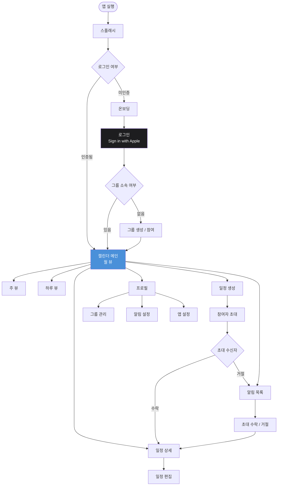
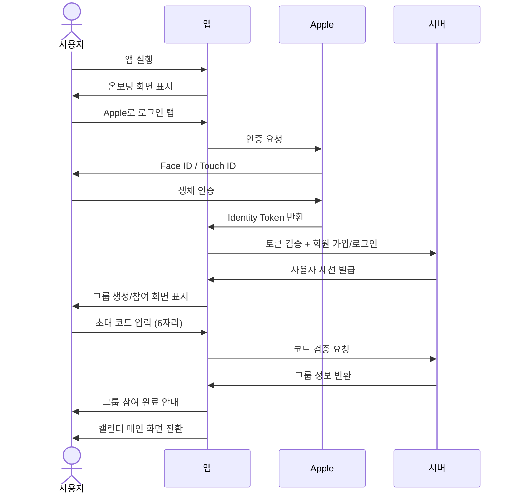
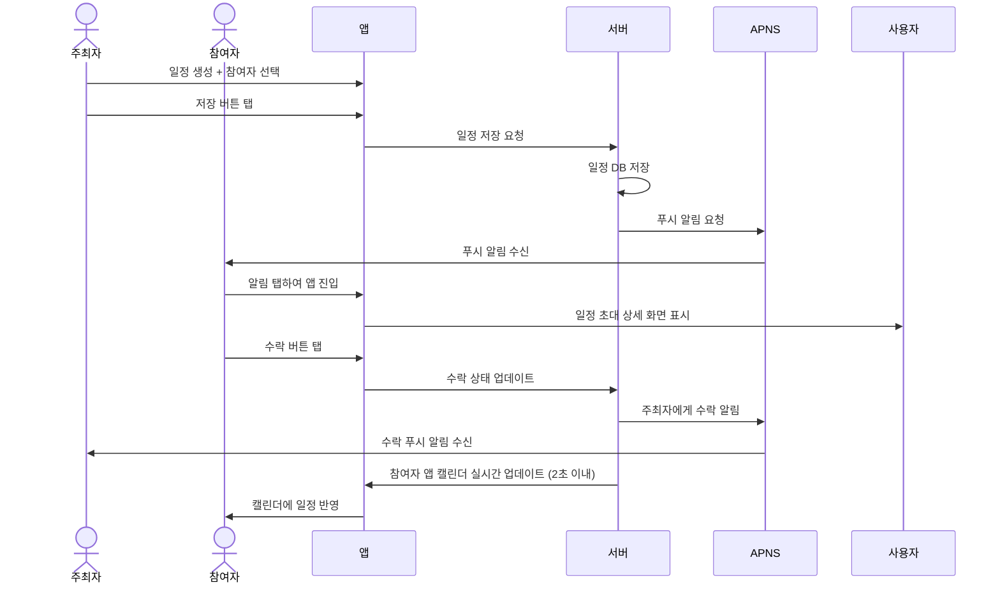
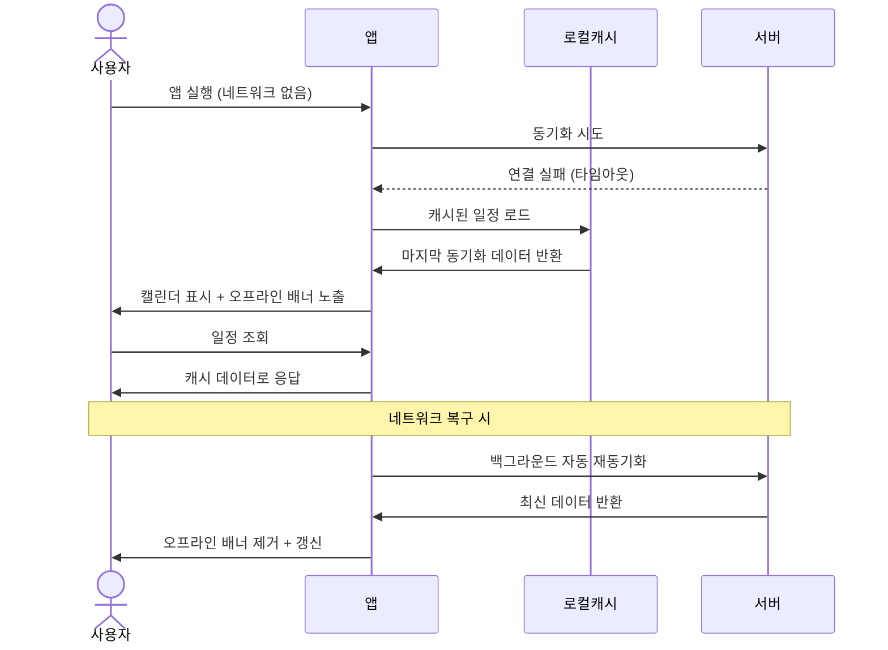

# 와이어프레임 & UX 플로우
생성일: 2026-03-04

---

## 1. 화면 목록

```
WeCal 전체 화면 계층 구조

├── 인증
│   ├── 스플래시 (Launch Screen)
│   ├── 온보딩 (3페이지 슬라이드)
│   └── 로그인 (Sign in with Apple)
│
├── 그룹 설정
│   ├── 그룹 생성 / 가입
│   │   ├── 새 그룹 만들기
│   │   ├── 초대 링크 공유
│   │   └── 코드 입력으로 참여
│   └── 그룹 관리
│       ├── 멤버 목록
│       └── 그룹 설정 (이름, 탈퇴)
│
├── 캘린더 (메인 탭)
│   ├── 월 뷰 (기본)
│   ├── 주 뷰
│   └── 하루 뷰
│
├── 일정
│   ├── 일정 상세 보기
│   ├── 일정 생성
│   │   ├── 기본 정보 입력
│   │   ├── 반복 설정
│   │   └── 참여자 초대
│   └── 일정 편집
│
├── 알림 (탭)
│   ├── 알림 목록
│   ├── 일정 초대 수락/거절
│   └── 변경 내역 확인
│
└── 프로필 (탭)
    ├── 내 정보
    ├── 그룹 목록
    ├── 알림 설정
    └── 앱 설정 (다크 모드, 언어)
```

---

## 2. 네비게이션 플로우



---

## 3. 핵심 화면 와이어프레임

### 화면 01 - 온보딩

**목적**: 신규 사용자에게 핵심 가치를 전달하고 로그인 유도

```
┌─────────────────────────────┐
│                             │
│                             │
│         [일러스트]          │
│    (캘린더 + 두 사람)       │
│                             │
│                             │
│   함께 쓰는 캘린더,         │
│   WeCal                     │
│                             │
│   가족, 연인과 일정을       │
│   실시간으로 공유하세요.    │
│                             │
│                             │
│   ● ○ ○   (페이지 인디케이터)│
│                             │
│                             │
│  ┌───────────────────────┐  │
│  │   Apple로 로그인      │  │
│  └───────────────────────┘  │
│                             │
│       건너뛰기              │
│                             │
└─────────────────────────────┘
```

**핵심 UI 컴포넌트**
- 풀스크린 일러스트 (스와이프로 3장 이동)
- 페이지 인디케이터 (현재 위치 표시)
- Sign in with Apple 버튼 (검정 배경, iOS 가이드라인 준수)
- 건너뛰기 링크 (3페이지에서는 숨김)

**사용자 인터랙션 포인트**
- 수평 스와이프로 온보딩 페이지 이동
- Apple로 로그인 버튼 탭 -> 시스템 인증 시트 표시
- 건너뛰기 탭 -> 마지막 페이지로 점프

---

### 화면 02 - 그룹 생성 / 참여

**목적**: 첫 로그인 후 공유 그룹 구성

```
┌─────────────────────────────┐
│  <                          │
│                             │
│   그룹을 만들거나           │
│   참여하세요                │
│                             │
│   WeCal은 그룹 단위로       │
│   일정을 공유합니다.        │
│                             │
│  ┌───────────────────────┐  │
│  │  + 새 그룹 만들기     │  │
│  └───────────────────────┘  │
│                             │
│         또는                │
│                             │
│  ┌───────────────────────┐  │
│  │  초대 코드 입력        │  │
│  └───────────────────────┘  │
│                             │
│  ┌──────────────────────┐   │
│  │  코드를 입력하세요   │   │
│  │  [  ] [  ] [  ] [  ] │   │
│  │  [  ] [  ]           │   │
│  └──────────────────────┘   │
│                             │
│  ┌───────────────────────┐  │
│  │       참여하기        │  │
│  └───────────────────────┘  │
│                             │
└─────────────────────────────┘
```

**핵심 UI 컴포넌트**
- 새 그룹 만들기 버튼 (주색 강조)
- 6자리 코드 입력 필드 (숫자 키보드 자동 표시)
- 참여하기 버튼 (코드 6자리 완성 시 활성화)

**사용자 인터랙션 포인트**
- 새 그룹 만들기 -> 그룹명 입력 시트 표시 -> 초대 링크/코드 자동 생성
- 코드 입력 -> 6자리 완성 즉시 자동 검증
- 코드 오류 시 인라인 에러 메시지 표시

---

### 화면 03 - 캘린더 메인 (월 뷰)

**목적**: 그룹 멤버들의 공유 일정을 한눈에 확인

```
┌─────────────────────────────┐
│  WeCal           🔔  👥     │
├─────────────────────────────┤
│  < 2026년 3월  >     월|주|일│
├──┬──┬──┬──┬──┬──┬──────────┤
│일│월│화│수│목│금│토          │
├──┼──┼──┼──┼──┼──┼──────────┤
│  │  │  │  │  │  │  1        │
├──┼──┼──┼──┼──┼──┼──────────┤
│ 2│ 3│ 4│●5│ 6│ 7│  8        │
├──┼──┼──┼──┼──┼──┼──────────┤
│ 9│10│11│12│13│14│ 15        │
│  │  │  │  │━━━━━━ 제주 여행 │
├──┼──┼──┼──┼──┼──┼──────────┤
│16│17│18│19│20│21│ 22        │
│  │  │●│  │  │  │           │
├──┼──┼──┼──┼──┼──┼──────────┤
│23│24│25│26│27│28│ 29        │
│  │  │  │  │  │  │           │
├──┼──┼──┼──┼──┼──┼──────────┤
│30│31│  │  │  │  │           │
├─────────────────────────────┤
│  5일 (목)                   │
│  ● 팀 회의 오전 10:00  [나] │
│  ● 병원 예약  오후 2:00 [짝]│
├─────────────────────────────┤
│  🏠 캘린더  🔔 알림  👤 나  │
└─────────────────────────────┘
```

**핵심 UI 컴포넌트**
- 상단 네비게이션: 앱 이름, 알림 아이콘(배지), 그룹 멤버 아이콘
- 월/주/일 뷰 세그먼트 컨트롤
- 월 캘린더 그리드: 오늘 날짜 원형 강조, 일정 있는 날 점 표시
- 멀티데이 일정 바 (━ 형태)
- 선택한 날짜 하단 일정 미리보기 (작성자 태그 [나]/[짝] 색상 구분)
- 하단 탭 바: 캘린더 / 알림 / 나

**사용자 인터랙션 포인트**
- 날짜 탭 -> 하단 미리보기 갱신 및 하루 뷰로 이동
- 헤더 좌우 화살표 -> 이전/다음 월 이동
- 일정 미리보기 탭 -> 일정 상세 화면 이동
- 우하단 FAB(+ 버튼) -> 일정 생성 화면 이동
- 당겨서 새로고침 -> 실시간 동기화 트리거

---

### 화면 04 - 일정 생성

**목적**: 새 일정 작성 및 그룹 멤버 초대

```
┌─────────────────────────────┐
│  취소        새 일정     저장│
├─────────────────────────────┤
│                             │
│  ┌───────────────────────┐  │
│  │  일정 제목            │  │
│  └───────────────────────┘  │
│                             │
│  ┌──────────┐ ┌──────────┐  │
│  │ 시작     │ │ 종료     │  │
│  │3/5 (목)  │ │3/5 (목)  │  │
│  │오전 10:00│ │오전 11:00│  │
│  └──────────┘ └──────────┘  │
│                             │
│  □ 하루 종일                │
│                             │
│  반복  ────────────  없음 > │
│                             │
│  위치  ────────────  추가 > │
│                             │
│  메모  ────────────  추가 > │
│                             │
│  ─────────── 참여자 ─────── │
│  ┌──────────────────────┐   │
│  │  + 멤버 초대         │   │
│  └──────────────────────┘   │
│  ○ 김민준 (나)          확인│
│  ○ 이서연               초대│
│                             │
│  공유 범위  ──────  그룹 공개│
│                             │
└─────────────────────────────┘
```

**핵심 UI 컴포넌트**
- 상단 네비게이션: 취소 / 저장 버튼
- 제목 입력 (자동 포커스, 키보드 즉시 표시)
- 날짜/시간 피커 (탭 시 인라인 DatePicker 확장)
- 하루 종일 토글
- 반복 / 위치 / 메모 셀 (탭 시 서브 화면 이동)
- 참여자 섹션: 그룹 멤버 목록, 초대 상태 표시
- 공유 범위 선택 (그룹 공개 / 나만 보기)

**사용자 인터랙션 포인트**
- 저장 버튼 -> 일정 저장 + 초대된 멤버에게 푸시 알림 발송
- 취소 버튼 -> 변경 사항 있으면 확인 액션 시트 표시
- 멤버 초대 탭 -> 그룹 멤버 선택 시트
- 하루 종일 토글 ON -> 시간 입력 필드 숨김

---

### 화면 05 - 일정 상세

**목적**: 일정 전체 정보 확인 및 초대 수락/거절

```
┌─────────────────────────────┐
│  <                    ···   │
├─────────────────────────────┤
│                             │
│  팀 회의                    │
│                             │
│  🗓  2026년 3월 5일 (목)    │
│      오전 10:00 - 11:00     │
│                             │
│  📍 강남 카페 A             │
│                             │
│  🔁 매주 목요일             │
│                             │
│  📝 다음 분기 계획 논의     │
│                             │
│  ─────────── 참여자 ─────── │
│  ● 김민준 (나)   주최자     │
│  ● 이서연        수락       │
│  ○ 박지훈        대기중     │
│                             │
│                             │
│  ─────── 내 응답 ──────────  │
│  ┌────────┐   ┌────────┐   │
│  │  수락  │   │  거절  │   │
│  └────────┘   └────────┘   │
│                             │
└─────────────────────────────┘
```

**핵심 UI 컴포넌트**
- 상단 뒤로가기 버튼 + 더보기 메뉴 (편집 / 삭제)
- 일정 제목 (큰 폰트, 강조)
- 정보 행: 아이콘 + 텍스트 (날짜/시간, 위치, 반복, 메모)
- 참여자 목록: 아바타 + 이름 + 응답 상태 (주최자/수락/거절/대기중)
- 내 응답 버튼 (수락 / 거절, 이미 응답한 경우 현재 상태 표시)

**사용자 인터랙션 포인트**
- 수락 버튼 -> 참여 확정, 주최자에게 알림 발송
- 거절 버튼 -> 거절 확정, 주최자에게 알림 발송
- 더보기(···) -> 편집 / 삭제 액션 시트 (주최자만)
- 참여자 아바타 탭 -> 멤버 프로필 미니 카드

---

### 화면 06 - 알림 목록

**목적**: 그룹 내 모든 초대 및 변경 내역 확인

```
┌─────────────────────────────┐
│  알림                 모두읽음│
├─────────────────────────────┤
│  오늘                       │
│ ┌─────────────────────────┐ │
│ │ 🟦 이서연님이 '제주 여행'│ │
│ │    일정에 초대했습니다.  │ │
│ │    3/13 (금) - 3/15(일) │ │
│ │    방금 전              │ │
│ │  [수락]       [거절]    │ │
│ └─────────────────────────┘ │
│ ┌─────────────────────────┐ │
│ │ 🟩 박지훈님이 '팀 회의' │ │
│ │    일정을 수락했습니다.  │ │
│ │    10분 전              │ │
│ └─────────────────────────┘ │
│                             │
│  어제                       │
│ ┌─────────────────────────┐ │
│ │ 🟨 '병원 예약' 일정이   │ │
│ │    1시간 후 시작됩니다. │ │
│ │    (리마인더)           │ │
│ └─────────────────────────┘ │
│ ┌─────────────────────────┐ │
│ │ 🟦 이서연님이 '저녁 식사'│ │
│ │    일정을 변경했습니다.  │ │
│ │    장소: 강남 → 홍대    │ │
│ └─────────────────────────┘ │
├─────────────────────────────┤
│  🏠 캘린더  🔔 알림  👤 나  │
└─────────────────────────────┘
```

**핵심 UI 컴포넌트**
- 날짜 섹션 헤더 (오늘 / 어제 / 날짜)
- 알림 카드: 타입별 색상 구분 (초대=파랑, 수락=초록, 리마인더=노랑, 변경=주황)
- 인라인 수락/거절 버튼 (초대 알림 전용)
- 읽지 않은 알림 배지

**사용자 인터랙션 포인트**
- 알림 카드 탭 -> 해당 일정 상세 화면으로 이동
- 수락/거절 버튼 -> 일정 상세 이동 없이 즉시 응답 처리
- 모두 읽음 버튼 -> 전체 알림 읽음 처리
- 스와이프 좌 -> 알림 삭제

---

### 화면 07 - 프로필 / 설정

**목적**: 사용자 정보 관리 및 그룹/알림/앱 설정

```
┌─────────────────────────────┐
│  나                         │
├─────────────────────────────┤
│                             │
│    ┌────┐                   │
│    │ 👤 │  김민준            │
│    └────┘  example@icloud   │
│            편집 >           │
│                             │
├─────────────────────────────┤
│  그룹                       │
│  우리 가족          멤버 3  │
│  민준 & 서연        멤버 2  │
│  + 새 그룹 만들기 / 참여    │
│                             │
├─────────────────────────────┤
│  알림 설정                  │
│  일정 초대         [ON ] >  │
│  일정 변경         [ON ] >  │
│  리마인더          [OFF] >  │
│  리마인더 시간     30분 전 > │
│                             │
├─────────────────────────────┤
│  앱 설정                    │
│  다크 모드         [시스템] >│
│  언어              [한국어] >│
│  데이터 동기화     [ON ] >  │
│                             │
├─────────────────────────────┤
│  로그아웃                   │
│  계정 삭제                  │
│                             │
├─────────────────────────────┤
│  🏠 캘린더  🔔 알림  👤 나  │
└─────────────────────────────┘
```

**핵심 UI 컴포넌트**
- 프로필 섹션: 아바타, 이름, 이메일, 편집 버튼
- 그룹 섹션: 가입 그룹 목록 + 새 그룹 추가 셀
- 알림 설정 섹션: 토글 + 세부 설정 이동
- 앱 설정 섹션: 다크 모드(시스템/라이트/다크), 언어
- 하단 위험 영역: 로그아웃 / 계정 삭제 (빨간 텍스트)

**사용자 인터랙션 포인트**
- 그룹 셀 탭 -> 그룹 상세/멤버 관리 화면
- 로그아웃 탭 -> 확인 액션 시트 후 로그인 화면으로
- 계정 삭제 탭 -> 확인 + Apple ID 재인증 요구

---

## 4. 핵심 인터랙션 플로우

### 플로우 A - 최초 가입 및 그룹 참여



---

### 플로우 B - 공동 일정 초대 및 수락



---

### 플로우 C - 오프라인 상태에서 캘린더 조회



---

## 5. 디자인 가이드라인 제안

### 색상 팔레트

| 역할 | 색상명 | Hex | 사용처 |
|------|--------|-----|--------|
| 주색 (Primary) | WeCal Blue | `#4A90D9` | CTA 버튼, 오늘 날짜 강조, 수락 상태 |
| 보조색 1 | Soft Teal | `#34C7A9` | 참여 완료 상태, 성공 메시지 |
| 보조색 2 | Warm Amber | `#F5A623` | 리마인더 알림, 대기 상태 |
| 위험색 | Alert Red | `#E74C3C` | 거절 버튼, 삭제, 에러 메시지 |
| 배경 (Light) | Off White | `#F5F5F7` | 메인 배경 |
| 배경 (Dark) | Deep Gray | `#1C1C1E` | 다크 모드 배경 (iOS 표준) |
| 표면 (Light) | White | `#FFFFFF` | 카드, 시트 배경 |
| 표면 (Dark) | Elevated Gray | `#2C2C2E` | 다크 모드 카드 배경 |
| 텍스트 주 (Light) | Charcoal | `#1D1D1F` | 본문 텍스트 |
| 텍스트 주 (Dark) | Pure White | `#FFFFFF` | 다크 모드 본문 |
| 텍스트 부 | Mid Gray | `#8E8E93` | 부제목, 힌트 텍스트 |

### 타이포그래피

iOS San Francisco 시스템 폰트 기반, Dynamic Type 완전 지원

| 스타일 | 크기 | 굵기 | 사용처 |
|--------|------|------|--------|
| Large Title | 34pt | Bold | 월 뷰 연/월 헤더 |
| Title 1 | 28pt | Bold | 온보딩 메인 헤드라인 |
| Title 2 | 22pt | Bold | 일정 제목 (상세 화면) |
| Headline | 17pt | Semibold | 섹션 헤더, 강조 셀 |
| Body | 17pt | Regular | 본문, 일정 목록 항목 |
| Callout | 16pt | Regular | 알림 카드 본문 |
| Subhead | 15pt | Regular | 날짜, 시간 표시 |
| Footnote | 13pt | Regular | 부가 정보, 타임스탬프 |
| Caption | 12pt | Regular | 참여 상태 라벨 |

### 전반적인 톤앤매너

**친밀하고 부드러운 미니멀리즘**

- **감성**: 차갑고 기능적인 생산성 도구가 아닌, 가까운 사람들과의 연결을 강조하는 따뜻한 느낌. 불필요한 장식 없이 필요한 정보에 집중하되, 인터랙션에서 작은 기쁨(Micro-interaction)을 제공한다.
- **여백**: 넉넉한 여백 사용 (최소 16pt 좌우 마진). 콘텐츠 간 호흡이 느껴지도록 그루핑.
- **모서리**: 모든 카드와 버튼에 둥근 모서리 적용 (cornerRadius 12~16pt). 날카로운 사각형 배제.
- **그림자**: 카드 컴포넌트에 부드러운 그림자 (shadowOpacity 0.08, shadowRadius 8). 다크 모드에서는 그림자 대신 배경색 대비로 구분.
- **애니메이션**: 화면 전환은 iOS 기본 슬라이드 전이 사용. 일정 추가/삭제 시 스프링 애니메이션(spring animation) 적용. 알림 배지 등장 시 팝 효과.
- **아이콘**: SF Symbols 전용 사용. 일관된 굵기(weight) 유지 (regular 또는 medium).
- **접근성**: 최소 터치 영역 44x44pt 준수, VoiceOver 레이블 모든 인터랙티브 요소에 적용, 고대비 모드 지원.
