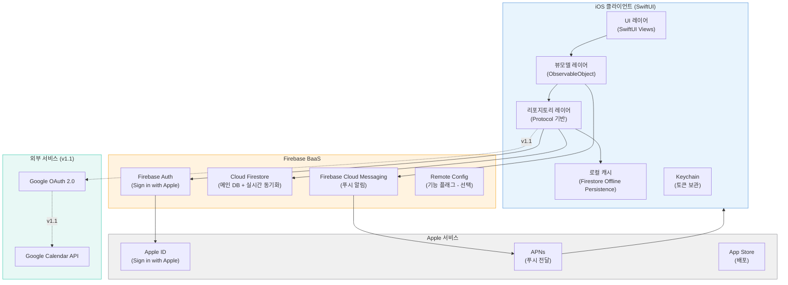
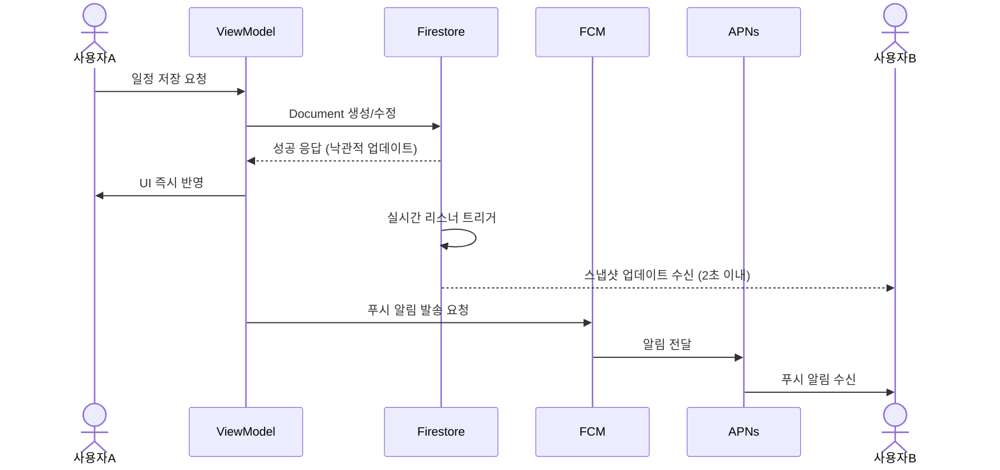
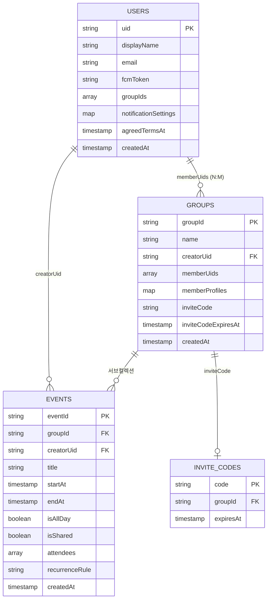

# 기술 스펙 문서
생성일: 2026-03-04

---

## 1. 시스템 아키텍처

### 1-1. 전체 아키텍처 개요

WeCal은 1인 개발자가 운영하는 iOS 전용 공유 캘린더 앱이다. 직접 서버를 운영하지 않고 Firebase BaaS(Backend as a Service)를 전면 활용하여 인프라 복잡도를 최소화한다. 클라이언트는 SwiftUI 기반 네이티브 앱이며, Firebase SDK를 통해 인증·데이터베이스·푸시 알림을 처리한다.



### 1-2. 주요 컴포넌트와 역할

| 컴포넌트 | 역할 | 비고 |
|----------|------|------|
| SwiftUI Views | 화면 렌더링, 사용자 입력 처리 | MVVM 패턴의 View |
| ObservableObject ViewModels | 비즈니스 로직, 상태 관리 | Combine + async/await |
| Repository Layer | Firebase SDK 추상화, 로컬/원격 데이터 통합 | Protocol 기반, 테스트 용이성 확보 |
| Firebase Auth | Sign in with Apple 토큰 검증, 세션 관리 | Firebase UID 발급 |
| Cloud Firestore | 일정/그룹/사용자 데이터 저장, 실시간 리스너 | 오프라인 퍼시스턴스 내장 |
| Firebase Cloud Messaging | 푸시 알림 발송 트리거 | APNs 경유 |
| Firestore Security Rules | 서버 사이드 접근 제어 | 그룹 멤버십 기반 |

### 1-3. 데이터 흐름

**일정 생성 및 실시간 동기화 흐름**



---

## 2. 기술 스택 선정

| 영역 | 기술 | 선택 이유 |
|------|------|----------|
| **Frontend** | SwiftUI (Swift 5.9+) | PRD 요구사항 명시. iOS 16+ 타겟에 SwiftUI가 완성도 높음. 1인 개발에서 UIKit 대비 생산성 우위 |
| **상태 관리** | Combine + async/await | Swift 표준 비동기 처리. Firestore 리스너를 AsyncStream으로 래핑하여 MVVM 패턴 유지 |
| **아키텍처 패턴** | MVVM + Repository Pattern | 테스트 가능한 구조 확보. Firebase 의존성을 Repository로 격리하여 추후 교체 가능 |
| **인증** | Firebase Auth + Sign in with Apple | PRD 요구사항 명시. Apple HIG 및 App Store 심사 지침 4.8조 준수 필수 |
| **데이터베이스** | Cloud Firestore | 실시간 리스너, 오프라인 퍼시스턴스, iOS SDK 성숙도 우위. 무료 티어(Spark Plan)로 초기 운영 가능 |
| **푸시 알림** | Firebase Cloud Messaging (FCM) | APNs 추상화 계층 제공. Firebase 생태계 내 통합 용이. 무료 |
| **로컬 캐시** | Firestore Offline Persistence | 별도 캐시 레이어 구현 없이 오프라인 읽기 지원. PRD 요구사항(오프라인 읽기) 충족 |
| **보안 저장소** | iOS Keychain (KeychainAccess 라이브러리) | PRD 요구사항 명시. OAuth 토큰을 UserDefaults 대신 Keychain에 저장 |
| **딥링크** | Firebase Dynamic Links (또는 커스텀 Universal Link) | 그룹 초대 Deferred Deep Link 처리. 앱 미설치 사용자의 App Store 이동 후 자동 참여 처리 |
| **CI/CD** | Xcode Cloud | Apple 생태계 네이티브 통합. TestFlight 배포 자동화. 1인 개발자에게 설정 비용 최소 |
| **충돌 해결** | Firestore Transactions + Last Write Wins | 동시 편집 충돌 정책 단순화. MVP에서는 LWW 적용, 추후 낙관적 잠금으로 전환 가능 |
| **외부 캘린더 (v1.1)** | Google Calendar API v3 + GoogleSignIn SDK | v1.1 요구사항. OAuth 2.0 기반 표준 연동 |
| **의존성 관리** | Swift Package Manager (SPM) | Xcode 내장 도구. CocoaPods 대비 설정 단순. Firebase, KeychainAccess 등 SPM 지원 |

---

## 3. API 설계

WeCal은 별도의 커스텀 REST API 서버를 운영하지 않는다. 클라이언트가 Firebase SDK를 통해 Firestore에 직접 읽기/쓰기하고, 서버 사이드 로직은 **Firestore Security Rules**와 **Firebase Functions (최소 활용)** 으로 처리한다.

### 3-1. Firestore 클라이언트 SDK 주요 오퍼레이션

아래는 REST 형식으로 표현한 Firestore 논리 API이다. 실제 구현은 Firestore iOS SDK의 Swift API를 사용한다.

---

#### 사용자 생성 / 조회

```
[생성] POST /users/{uid}
설명: Sign in with Apple 인증 후 사용자 프로필 초기 생성 또는 갱신

Request Body:
{
  "uid": "string",               // Firebase UID (Apple sub 클레임 기반)
  "displayName": "string",       // Apple에서 제공한 이름 또는 기본값
  "email": "string | null",      // Apple에서 제공한 이메일 (은닉 이메일 포함)
  "fcmToken": "string",          // 현재 기기의 FCM 토큰
  "createdAt": "timestamp",
  "updatedAt": "timestamp",
  "agreedTermsAt": "timestamp",  // 이용약관 동의 시각
  "agreedTermsVersion": "string" // 약관 버전 (e.g., "1.0")
}

Response:
{
  "success": true,
  "uid": "string"
}

보안 규칙: 본인 UID 문서만 생성/수정 허용
```

---

#### 그룹 생성

```
[생성] POST /groups/{groupId}
설명: 새 그룹 생성. groupId는 클라이언트가 UUID로 생성

Request Body:
{
  "groupId": "string (UUID)",
  "name": "string",              // 그룹 이름 (기본값: "우리의 캘린더")
  "creatorUid": "string",        // 생성자 Firebase UID
  "memberUids": ["string"],      // 초기 멤버 (생성자만 포함)
  "inviteCode": "string (6자리)", // 서버에서 검증, 클라이언트가 랜덤 생성
  "inviteCodeExpiresAt": "timestamp", // 생성 후 72시간
  "createdAt": "timestamp"
}

Response:
{
  "groupId": "string",
  "inviteCode": "string",
  "inviteLink": "string"         // Dynamic Link URL
}

보안 규칙: 인증된 사용자만 생성 허용
```

---

#### 그룹 참여 (초대 코드 검증)

```
[조회] GET /groups?inviteCode={code}
설명: 초대 코드로 그룹 조회. 유효성 및 만료 여부 검증

Response (성공):
{
  "groupId": "string",
  "name": "string",
  "memberCount": 3,
  "creatorDisplayName": "string"
}

Response (실패):
{
  "error": "INVALID_CODE" | "EXPIRED_CODE" | "GROUP_FULL"
}

[수정] PATCH /groups/{groupId}/members
설명: 그룹에 사용자 추가 (참여 처리)

Request Body:
{
  "uid": "string"    // 참여할 사용자 UID
}

보안 규칙: 초대 코드 검증 후 본인만 멤버 추가 가능, 최대 5인 제한은 Security Rules에서 강제
```

---

#### 일정 생성 / 수정 / 삭제

```
[생성] POST /groups/{groupId}/events/{eventId}
설명: 그룹 내 일정 생성. eventId는 클라이언트가 UUID로 생성

Request Body:
{
  "eventId": "string (UUID)",
  "groupId": "string",
  "creatorUid": "string",
  "title": "string",             // 필수
  "startAt": "timestamp",        // 필수
  "endAt": "timestamp",          // 필수
  "isAllDay": "boolean",
  "location": "string | null",
  "memo": "string | null",
  "isShared": "boolean",         // true: 그룹 공개, false: 개인
  "attendees": [                 // 초대된 참여자 목록
    {
      "uid": "string",
      "status": "pending"        // pending | accepted | declined
    }
  ],
  "createdAt": "timestamp",
  "updatedAt": "timestamp"
}

Response:
{
  "eventId": "string",
  "success": true
}

[수정] PATCH /groups/{groupId}/events/{eventId}
Request Body: (변경된 필드만 포함)
{
  "title": "string",
  "startAt": "timestamp",
  "updatedAt": "timestamp"
}

[삭제] DELETE /groups/{groupId}/events/{eventId}

보안 규칙: 해당 그룹의 멤버만 접근 가능. 수정/삭제는 creatorUid 본인만 허용
```

---

#### 일정 초대 수락 / 거절

```
[수정] PATCH /groups/{groupId}/events/{eventId}/attendees/{uid}
설명: 초대 수락 또는 거절 상태 업데이트

Request Body:
{
  "status": "accepted" | "declined",
  "respondedAt": "timestamp"
}

보안 규칙: 본인 UID의 attendee 상태만 수정 허용
```

---

#### 실시간 리스너 (Firestore Snapshot Listener)

```
[구독] LISTEN /groups/{groupId}/events
설명: 그룹 이벤트 컬렉션의 실시간 변경 수신

Swift 구현 예시:
  db.collection("groups/\(groupId)/events")
    .addSnapshotListener { snapshot, error in
      // 2초 이내 변경 수신
    }

필터:
  - startAt >= 오늘 기준 30일 전 (과거 데이터 무한 로드 방지)
  - isShared == true OR creatorUid == currentUserUid
```

---

#### FCM 토큰 갱신

```
[수정] PATCH /users/{uid}
설명: 앱 실행 시 또는 FCM 토큰 갱신 시 서버에 최신 토큰 업데이트

Request Body:
{
  "fcmToken": "string",
  "updatedAt": "timestamp"
}
```

---

#### Google Calendar 연동 (v1.1)

```
[조회] GET /google-calendar/events
설명: 연동된 Google Calendar 이벤트 목록 조회
      클라이언트가 GoogleSignIn SDK 토큰으로 Google Calendar API v3를 직접 호출

Google Calendar API 호출:
  GET https://www.googleapis.com/calendar/v3/calendars/primary/events
  Authorization: Bearer {google_access_token}
  QueryParams:
    timeMin: {ISO8601}
    timeMax: {ISO8601}
    singleEvents: true
    orderBy: startTime

Response: Google Calendar Event 리소스 배열
  (WeCal 내부 Event 모델로 매핑하여 뷰 레이어에서 레이어 합산 표시)
```

---

### 3-2. Firestore Security Rules 핵심 로직

```javascript
rules_version = '2';
service cloud.firestore {
  match /databases/{database}/documents {

    // 사용자 문서: 본인만 읽기/쓰기
    match /users/{uid} {
      allow read, write: if request.auth != null && request.auth.uid == uid;
    }

    // 그룹 문서: 멤버만 읽기 허용, 생성은 인증된 사용자
    match /groups/{groupId} {
      allow read: if request.auth != null
                  && request.auth.uid in resource.data.memberUids;
      allow create: if request.auth != null;
      allow update: if request.auth != null
                    && request.auth.uid in resource.data.memberUids
                    && resource.data.memberUids.size() < 5; // 최대 5인 강제

      // 일정 서브컬렉션: 그룹 멤버만 접근
      match /events/{eventId} {
        allow read: if request.auth != null
                    && isGroupMember(groupId);
        allow create: if request.auth != null
                      && isGroupMember(groupId)
                      && request.resource.data.creatorUid == request.auth.uid;
        allow update: if request.auth != null
                      && isGroupMember(groupId)
                      && (resource.data.creatorUid == request.auth.uid
                          || isAttendeeStatusUpdate());
        allow delete: if request.auth != null
                      && resource.data.creatorUid == request.auth.uid;
      }
    }

    // 헬퍼 함수
    function isGroupMember(groupId) {
      return request.auth.uid in get(/databases/$(database)/documents/groups/$(groupId)).data.memberUids;
    }

    function isAttendeeStatusUpdate() {
      // attendees 배열 내 본인 UID 항목의 status만 변경하는지 검증
      return request.resource.data.diff(resource.data).affectedKeys().hasOnly(['attendees', 'updatedAt']);
    }
  }
}
```

---

## 4. 데이터베이스 스키마

### 4-1. Firestore 컬렉션 구조

```
firestore-root/
├── users/
│   └── {uid}/                    # 사용자 문서
├── groups/
│   └── {groupId}/                # 그룹 문서
│       └── events/
│           └── {eventId}/        # 일정 문서
└── inviteCodes/
    └── {code}/                   # 초대 코드 인덱스 (조회 최적화)
```

---

### 4-2. 컬렉션 스키마 상세

#### users 컬렉션

| 필드명 | 타입 | 필수 | 설명 |
|--------|------|------|------|
| `uid` | `string` | Y | Firebase Auth UID (Document ID와 동일) |
| `displayName` | `string` | Y | 사용자 이름 (Apple 제공 또는 기본값) |
| `email` | `string` | N | Apple ID 이메일 (은닉 이메일 가능, null 허용) |
| `photoURL` | `string` | N | 프로필 이미지 URL (미지원 시 null) |
| `fcmToken` | `string` | N | 현재 기기 FCM 토큰 (기기 변경 시 갱신) |
| `groupIds` | `array<string>` | Y | 소속 그룹 ID 목록 (최대 10개 제한) |
| `agreedTermsVersion` | `string` | Y | 동의한 이용약관 버전 (e.g., "1.0") |
| `agreedTermsAt` | `timestamp` | Y | 이용약관 동의 시각 |
| `notificationSettings` | `map` | Y | 알림 설정 (하단 상세) |
| `createdAt` | `timestamp` | Y | 계정 생성 시각 |
| `updatedAt` | `timestamp` | Y | 최종 수정 시각 |
| `deletedAt` | `timestamp` | N | 탈퇴 처리 시각 (soft delete, 30일 후 영구 삭제) |

`notificationSettings` 중첩 맵:
```json
{
  "inviteEnabled": true,
  "changeEnabled": true,
  "reminderEnabled": true,
  "reminderMinutesBefore": 60,
  "quietHoursEnabled": true,
  "quietHoursStart": "23:00",
  "quietHoursEnd": "08:00"
}
```

**인덱스**: 단일 문서 접근 패턴. 추가 인덱스 불필요.

---

#### groups 컬렉션

| 필드명 | 타입 | 필수 | 설명 |
|--------|------|------|------|
| `groupId` | `string` | Y | UUID (Document ID와 동일) |
| `name` | `string` | Y | 그룹 이름 (기본값: "우리의 캘린더") |
| `creatorUid` | `string` | Y | 그룹 생성자 Firebase UID |
| `memberUids` | `array<string>` | Y | 그룹 멤버 UID 배열 (최대 5인) |
| `memberProfiles` | `map` | Y | 멤버별 표시 정보 캐시 (displayName, photoURL) |
| `inviteCode` | `string` | N | 현재 유효한 초대 코드 (6자리, null = 만료) |
| `inviteCodeExpiresAt` | `timestamp` | N | 초대 코드 만료 시각 (생성 후 72시간) |
| `createdAt` | `timestamp` | Y | 그룹 생성 시각 |
| `updatedAt` | `timestamp` | Y | 최종 수정 시각 |

`memberProfiles` 중첩 맵 (조회 최적화용 비정규화):
```json
{
  "{uid1}": { "displayName": "김민준", "photoURL": null },
  "{uid2}": { "displayName": "이서연", "photoURL": null }
}
```

**인덱스**:
- `inviteCode` 단일 필드 인덱스 → 초대 코드 조회에 활용
- `memberUids` array-contains 인덱스 → 사용자별 그룹 목록 조회

---

#### groups/{groupId}/events 서브컬렉션

| 필드명 | 타입 | 필수 | 설명 |
|--------|------|------|------|
| `eventId` | `string` | Y | UUID (Document ID와 동일) |
| `groupId` | `string` | Y | 소속 그룹 ID |
| `creatorUid` | `string` | Y | 일정 생성자 UID |
| `title` | `string` | Y | 일정 제목 (최대 100자) |
| `startAt` | `timestamp` | Y | 시작 일시 |
| `endAt` | `timestamp` | Y | 종료 일시 |
| `isAllDay` | `boolean` | Y | 하루 종일 여부 |
| `location` | `string` | N | 장소 (최대 200자, null 허용) |
| `memo` | `string` | N | 메모 (최대 1000자, null 허용) |
| `isShared` | `boolean` | Y | 그룹 공유 여부 (false = 개인 일정) |
| `attendees` | `array<map>` | Y | 참여자 목록 (하단 상세) |
| `reminderMinutes` | `array<number>` | N | 리마인더 시간 목록 (e.g., [60, 1440]) |
| `recurrenceRule` | `string` | N | iCal RRULE 형식 (e.g., "FREQ=WEEKLY;BYDAY=TH") |
| `googleEventId` | `string` | N | Google Calendar 이벤트 ID (v1.1, 중복 방지용) |
| `createdAt` | `timestamp` | Y | 생성 시각 |
| `updatedAt` | `timestamp` | Y | 최종 수정 시각 |
| `deletedAt` | `timestamp` | N | 삭제 시각 (soft delete) |

`attendees` 배열 내 항목:
```json
[
  {
    "uid": "string",
    "displayName": "string",
    "status": "pending | accepted | declined",
    "respondedAt": "timestamp | null"
  }
]
```

**인덱스**:
- `startAt` 오름차순 + `isShared` 복합 인덱스 → 기간별 일정 조회
- `creatorUid` + `startAt` 복합 인덱스 → 개인 일정 조회
- `attendees.uid` array-contains + `startAt` → 참여자별 일정 조회 (Collection Group Query)

---

#### inviteCodes 컬렉션 (인덱스 보조)

| 필드명 | 타입 | 필수 | 설명 |
|--------|------|------|------|
| `code` | `string` | Y | 6자리 초대 코드 (Document ID와 동일) |
| `groupId` | `string` | Y | 연결된 그룹 ID |
| `expiresAt` | `timestamp` | Y | 만료 시각 |
| `createdAt` | `timestamp` | Y | 생성 시각 |

**목적**: groups 컬렉션 전체를 스캔하지 않고 초대 코드로 그룹 ID를 O(1)로 조회

---

### 4-3. ERD (논리 관계)



---

## 5. 인프라 및 배포

### 5-1. 클라우드 서비스 구성

| 서비스 | 플랜 | 용도 | 비용 |
|--------|------|------|------|
| Firebase (Google Cloud) | Spark (무료) | Auth, Firestore, FCM | 무료 (초기 운영) |
| Firebase Firestore | Spark 무료 한도 | 1GB 저장, 50K 읽기/일, 20K 쓰기/일 | 무료 |
| Firebase Dynamic Links | 무료 | 초대 딥링크 | 무료 |
| Apple Developer Program | 개인 | App Store 배포, APNs, TestFlight | $99/년 |
| Xcode Cloud | 무료 (25시간/월) | CI/CD 빌드, TestFlight 배포 | 무료 (초기) |
| Google Cloud Console | 무료 | Google OAuth 앱 등록 (v1.1) | 무료 |

**Firebase 무료 한도 초과 예측**:
- 활성 사용자 500명 기준: 일정 CRUD 및 실시간 동기화 합산 일 읽기 ~30K, 쓰기 ~5K → Spark 한도 내 운영 가능
- 사용자 1,000명 초과 시 Blaze(종량제) 전환 필요. 예상 월 비용 $5~$15 수준

### 5-2. CI/CD 파이프라인

```mermaid
graph LR
    A[개발자 Push\ngit push origin] --> B[Xcode Cloud\n빌드 트리거]
    B --> C{브랜치}
    C -- feature/* --> D[빌드 + 단위 테스트\n(자동)]
    C -- main --> E[빌드 + 전체 테스트\n+ TestFlight 배포]
    E --> F[TestFlight\n베타 테스터]
    F --> G{검증 완료}
    G -- 승인 --> H[App Store\n심사 제출]
    H --> I[App Store\n공개 배포]
```

**Xcode Cloud Workflow 구성**:
- **feature 브랜치**: 빌드 + SwiftUI Preview 정적 분석 + Unit Test
- **main 브랜치**: 빌드 + Unit Test + UI Test (핵심 플로우) + TestFlight 자동 업로드
- **릴리즈 태그 (v*)**: App Store Connect에 자동 제출 (심사는 수동 승인)

### 5-3. 환경 구성

| 환경 | Firebase 프로젝트 | 용도 | 접근 |
|------|-----------------|------|------|
| 개발 (Debug) | `wecal-dev` | 로컬 개발, 기능 개발 | 개발자 기기 |
| 스테이징 (TestFlight) | `wecal-staging` | QA, 베타 테스트 | TestFlight 초대자 |
| 프로덕션 (Release) | `wecal-prod` | 실제 사용자 | App Store |

**환경 분리 방법**:
- Xcode Build Configuration: Debug / Staging / Release
- `GoogleService-Info.plist` 환경별 분리 (xcconfig 활용)
- Bundle ID: `com.wecal.app` (prod), `com.wecal.app.staging` (staging)

---

## 6. 보안 설계

### 6-1. 인증 및 인가

| 항목 | 구현 방법 |
|------|----------|
| 인증 방식 | Sign in with Apple → Firebase Auth Identity Token 검증 |
| 세션 관리 | Firebase ID Token (1시간 만료) + Refresh Token (자동 갱신, 유효기간 없음) |
| 토큰 저장 | Firebase Refresh Token → iOS Keychain (kSecClassGenericPassword) |
| 자동 로그인 | Firebase Auth 상태 유지 + Keychain 토큰으로 앱 재실행 시 복원 |
| 강제 로그아웃 | Firebase Auth 세션 무효화 + Keychain 항목 삭제 |

### 6-2. 데이터 접근 제어

```
계층 1 - Firebase Auth: 비인증 요청 원천 차단
계층 2 - Firestore Security Rules: 그룹 멤버십 기반 세밀한 접근 제어
          - 타 그룹 데이터 읽기 불가
          - 본인 생성 일정만 수정/삭제 가능
          - 참여자 본인 응답 상태만 변경 가능
계층 3 - 클라이언트 검증: 입력값 유효성 검사 (Swift 레이어)
```

### 6-3. 데이터 암호화

| 항목 | 방법 |
|------|------|
| 전송 구간 암호화 | TLS 1.2 이상 (Firebase SDK 기본 적용) |
| 저장 데이터 암호화 | Firebase 기본 AES-256 암호화 (Google 관리 키) |
| 민감 정보 로컬 저장 | iOS Keychain (AES-256, Secure Enclave 연동) |
| 디버그 로그 | Release 빌드에서 모든 개인정보 로그 비활성화 (`#if DEBUG` 래핑) |

### 6-4. API 보안

| 항목 | 방법 |
|------|------|
| Firebase 규칙 | 모든 읽기/쓰기에 `request.auth != null` 조건 필수 |
| Google API 키 | `GoogleService-Info.plist`에 포함, App Bundle 제한으로 도용 방지 |
| OAuth 스코프 | Google Calendar: `https://www.googleapis.com/auth/calendar.events`만 요청 |
| 초대 코드 무차별 대입 방지 | Firestore Security Rules에서 잘못된 코드 조회 횟수 제한 (Rate limit 로직 적용) |

### 6-5. 개인정보 처리

| 항목 | 방법 |
|------|------|
| 수집 최소화 | Apple ID 이름, 이메일(선택), FCM 토큰만 수집 |
| 데이터 삭제 | 탈퇴 요청 시 Soft Delete → 30일 후 Firestore 문서 및 Firebase Auth 계정 영구 삭제 |
| 법적 근거 | 개인정보보호법(PIPA) 준수, 이용약관 버전별 동의 기록 보관 |
| Apple 개인정보 정책 | App Store Privacy Nutrition Label 정확히 작성 |

---

## 7. 성능 고려사항

### 7-1. 예상 트래픽 및 병목 지점

| 시점 | 예상 DAU | Firestore 읽기/일 | Firestore 쓰기/일 | 병목 예상 |
|------|---------|-----------------|-----------------|----------|
| 베타 출시 (D+0) | ~100명 | ~5,000 | ~1,000 | 없음 |
| 오픈 (D+1개월) | ~500명 | ~25,000 | ~5,000 | Spark 한도 50K 접근 |
| 성장 (D+6개월) | ~2,000명 | ~100,000 | ~20,000 | Blaze 전환 필수 |

**병목 지점 분석**:
1. **Firestore 실시간 리스너 연결 수**: 동시 접속자 수 * 그룹당 리스너 수. 초기에는 문제없으나 1,000명 이상에서 모니터링 필요
2. **FCM 알림 발송 지연**: 서버리스 구조에서 Firebase Functions 콜드 스타트 없이 클라이언트 SDK 직접 발송 방식으로 지연 최소화
3. **초대 코드 조회**: `inviteCodes` 컬렉션 별도 분리로 O(1) 조회 보장

### 7-2. 캐싱 전략

| 레이어 | 전략 | 구현 |
|--------|------|------|
| Firestore 오프라인 퍼시스턴스 | SQLite 기반 로컬 캐시 | `Firestore.firestore().settings.isPersistenceEnabled = true` (기본값) |
| 캐시 크기 제한 | 100MB (기본값 유지) | 일정 데이터 특성상 충분한 용량 |
| 이미지 캐시 | 없음 (MVP에서 프로필 이미지 미지원) | v1.1에서 SDWebImage 또는 Kingfisher 도입 검토 |
| 그룹 멤버 프로필 | Firestore 문서 내 비정규화 (`memberProfiles` 맵) | 별도 users 문서 조회 없이 그룹 문서에서 일괄 로드 |
| 조회 범위 제한 | 현재 월 ±2개월 범위만 실시간 구독 | 불필요한 과거 데이터 로드 방지 |

### 7-3. 클라이언트 성능 최적화

| 항목 | 전략 |
|------|------|
| SwiftUI 렌더링 | `@State`, `@StateObject` 최소화. `Equatable` 준수로 불필요한 재렌더링 방지 |
| 일정 목록 | `LazyVStack` + `List` 활용으로 대량 일정 렌더링 최적화 |
| 이미지/아이콘 | SF Symbols 전용 사용으로 번들 크기 최소화 |
| 앱 초기 로딩 | 스플래시 → 캘린더 진입 3초 이내. Firebase Auth 상태 복원과 Firestore 첫 쿼리를 병렬 실행 |
| 배터리 | 백그라운드에서 Firestore 리스너 일시 정지 (scenePhase 감지) |

### 7-4. 확장 방안

| 단계 | 임계치 | 대응 |
|------|--------|------|
| 단기 | DAU 1,000명 / Spark 한도 초과 | Firebase Blaze 전환 (종량제) |
| 중기 | 그룹 5인 초과 수요 | Firestore Security Rules 수정 + 유료 플랜 연계 |
| 중기 | 알림 커스터마이징 | Firebase Functions 도입 (스케줄 기반 리마인더 발송) |
| 장기 | Android 지원 | Kotlin Multiplatform 또는 Flutter 검토. Firebase 생태계 그대로 활용 가능 |
| 장기 | 글로벌 확장 | Firebase Multi-region 설정 변경만으로 대응 가능 |

---

## 8. 외부 서비스 의존성

### 8-1. v1.0 의존성

| 서비스 | SDK | 용도 | 무료 한도 | 유료 전환 시점 |
|--------|-----|------|----------|--------------|
| Firebase Auth | `firebase-ios-sdk` | Sign in with Apple 토큰 검증 | 무제한 | 해당 없음 |
| Cloud Firestore | `firebase-ios-sdk` | 메인 DB + 실시간 동기화 | 1GB 저장, 50K 읽기/일, 20K 쓰기/일 | DAU ~800명 초과 시 |
| Firebase Cloud Messaging | `firebase-ios-sdk` | 푸시 알림 발송 | 무제한 | 해당 없음 |
| Firebase Dynamic Links | `firebase-ios-sdk` | 초대 딥링크 | 무제한 | 해당 없음 |
| Apple APNs | iOS SDK 내장 | FCM → APNs 중계 | 무제한 | 해당 없음 |
| Sign in with Apple | `AuthenticationServices` | Apple ID 인증 | 무제한 | 해당 없음 |
| KeychainAccess | SPM 라이브러리 | Keychain 추상화 | 오픈소스 | 해당 없음 |

### 8-2. v1.1 추가 의존성

| 서비스 | SDK | 용도 | 무료 한도 | 유료 전환 시점 |
|--------|-----|------|----------|--------------|
| Google Calendar API v3 | REST API (URLSession) | 이벤트 CRUD | 1백만 requests/일 | 초기 운영 범위 내 무료 |
| GoogleSignIn-iOS | SPM `GoogleSignIn` | Google OAuth 2.0 | 무료 | 해당 없음 |

### 8-3. SPM 의존성 목록

```swift
// Package.swift dependencies (주요 항목)
dependencies: [
    // Firebase iOS SDK (Auth, Firestore, FCM, Dynamic Links)
    .package(url: "https://github.com/firebase/firebase-ios-sdk",
             from: "10.0.0"),

    // Keychain 추상화
    .package(url: "https://github.com/kishikawakatsumi/KeychainAccess",
             from: "4.2.0"),

    // Google Sign-In (v1.1)
    .package(url: "https://github.com/google/GoogleSignIn-iOS",
             from: "7.0.0"),
]
```

### 8-4. Firebase 주요 한도 요약 (Spark 무료 플랜)

| 항목 | 한도 | WeCal 예상 사용량 (500 DAU) |
|------|------|---------------------------|
| Firestore 저장 용량 | 1 GiB | ~50 MB (일정 데이터 기준) |
| Firestore 읽기 | 50,000 / 일 | ~25,000 / 일 |
| Firestore 쓰기 | 20,000 / 일 | ~5,000 / 일 |
| Firestore 삭제 | 20,000 / 일 | ~500 / 일 |
| Cloud Functions | 125K 호출 / 월 | 미사용 (v1.0) |
| Dynamic Links | 무제한 | 초대 코드 생성 시 |
| FCM | 무제한 | 알림 발송 |

---

## 9. iOS 프로젝트 구조

```
WeCal/
├── App/
│   ├── WeCalApp.swift           # @main, Firebase 초기화
│   └── AppDelegate.swift        # FCM 토큰 갱신, APNs 등록
│
├── Core/
│   ├── Auth/
│   │   ├── AuthViewModel.swift
│   │   └── AuthRepository.swift
│   ├── Calendar/
│   │   ├── CalendarViewModel.swift
│   │   └── EventRepository.swift
│   ├── Group/
│   │   ├── GroupViewModel.swift
│   │   └── GroupRepository.swift
│   └── Notification/
│       ├── NotificationViewModel.swift
│       └── NotificationRepository.swift
│
├── Features/
│   ├── Onboarding/
│   ├── Calendar/
│   │   ├── MonthView.swift
│   │   ├── WeekView.swift
│   │   └── DayView.swift
│   ├── Event/
│   │   ├── EventDetailView.swift
│   │   └── EventCreateView.swift
│   ├── Group/
│   │   ├── GroupSetupView.swift
│   │   └── GroupManageView.swift
│   ├── Notification/
│   │   └── NotificationListView.swift
│   └── Profile/
│       └── ProfileView.swift
│
├── Models/
│   ├── User.swift
│   ├── Group.swift
│   └── CalendarEvent.swift
│
├── Services/
│   ├── FirestoreService.swift   # Firestore 래퍼
│   ├── AuthService.swift        # Firebase Auth 래퍼
│   ├── FCMService.swift         # FCM 토큰 관리
│   └── KeychainService.swift    # Keychain 추상화
│
├── Utils/
│   ├── DateExtensions.swift
│   └── ColorExtensions.swift
│
└── Resources/
    ├── GoogleService-Info-Debug.plist
    ├── GoogleService-Info-Staging.plist
    └── GoogleService-Info-Release.plist
```

---

## 10. 변경 이력

| 버전 | 날짜 | 변경 내용 |
|------|------|----------|
| 1.0 | 2026-03-04 | 최초 작성 (v1.0 기준) |
