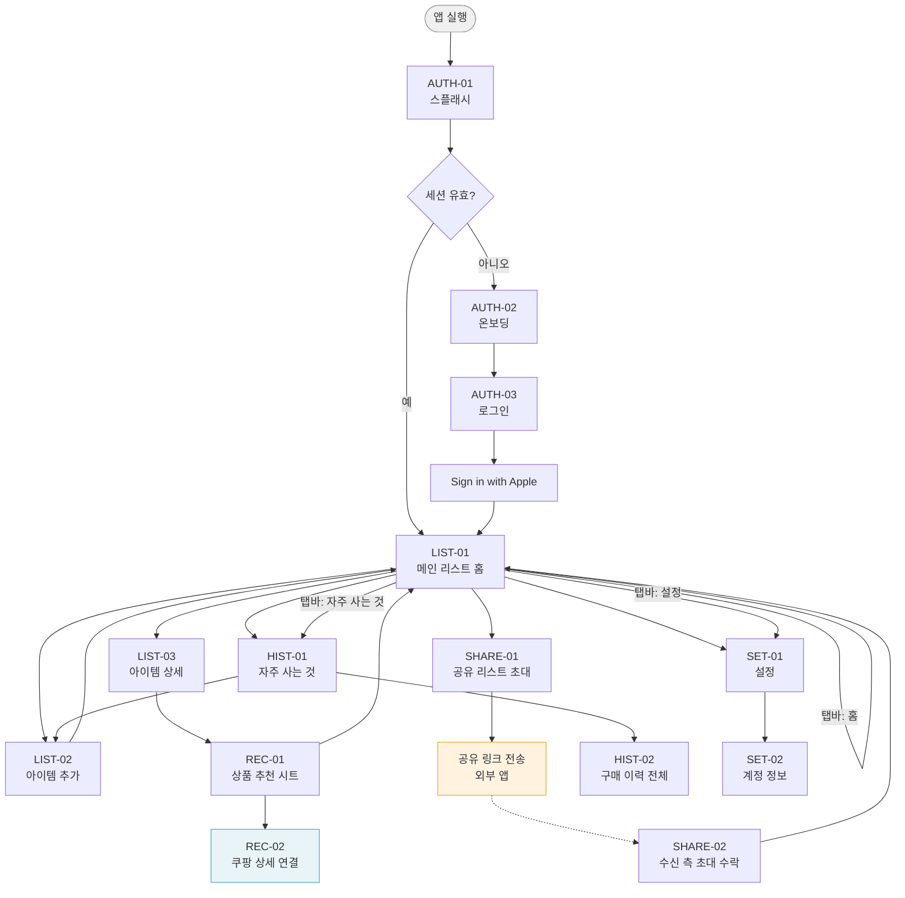
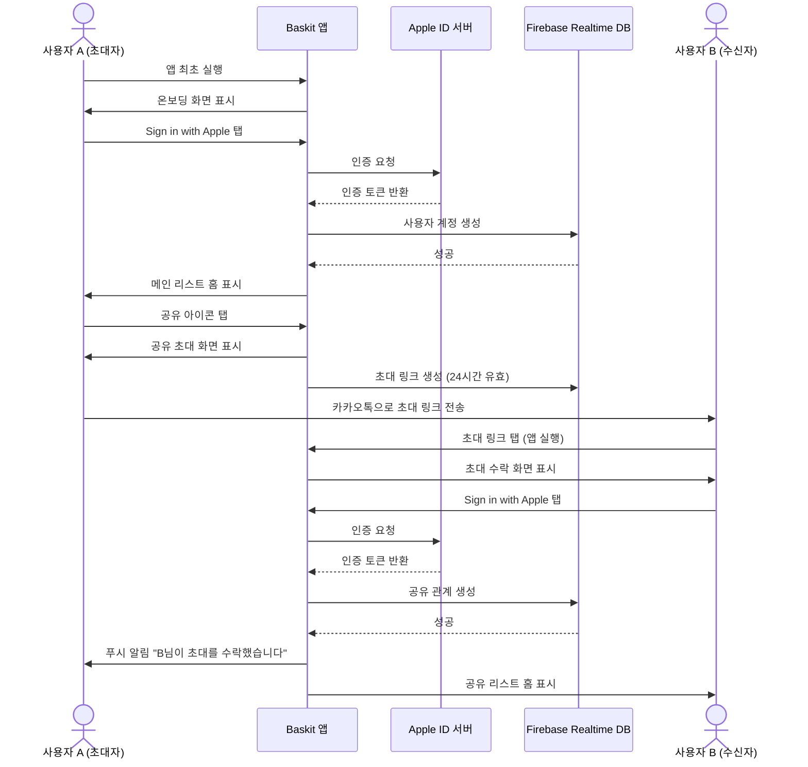
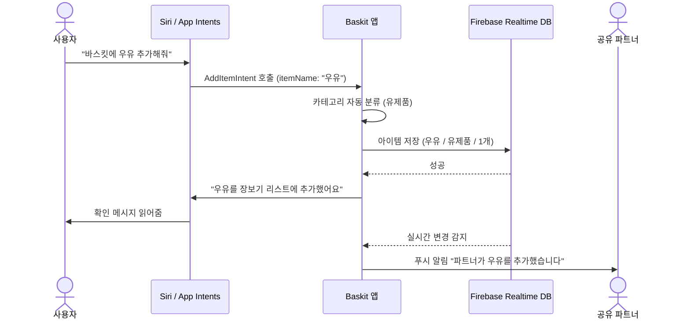
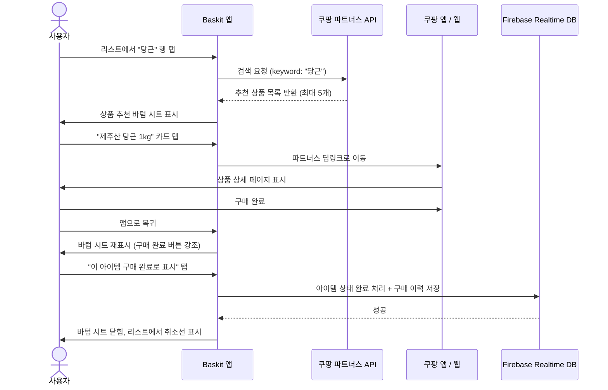

# 와이어프레임 & UX 플로우
생성일: 2026-03-10

---

## 1. 화면 목록

### 1.1 인증 영역
| 화면 ID | 화면명 | 설명 |
|---------|--------|------|
| AUTH-01 | 스플래시 | 앱 로딩 및 세션 확인 |
| AUTH-02 | 온보딩 | 앱 핵심 기능 소개 (최초 설치 시) |
| AUTH-03 | 로그인 | Sign in with Apple 진입점 |

### 1.2 메인 리스트 영역
| 화면 ID | 화면명 | 설명 |
|---------|--------|------|
| LIST-01 | 메인 리스트 홈 | 현재 장보기 리스트 전체 보기, 카테고리 탭 |
| LIST-02 | 아이템 추가 | 직접 입력 / Siri 입력 결과 수신 |
| LIST-03 | 아이템 상세 | 수량, 메모, 카테고리 수정 |
| LIST-04 | 카테고리 관리 | 카테고리 추가·편집·삭제 |

### 1.3 공유 영역
| 화면 ID | 화면명 | 설명 |
|---------|--------|------|
| SHARE-01 | 공유 리스트 초대 | 파트너 초대 링크 생성 및 전송 |
| SHARE-02 | 공유 리스트 수락 | 수신 측 초대 수락 화면 |
| SHARE-03 | 동기화 상태 | 실시간 파트너 편집 상태 표시 (인라인) |

### 1.4 상품 추천 영역
| 화면 ID | 화면명 | 설명 |
|---------|--------|------|
| REC-01 | 상품 추천 시트 | 아이템 탭 시 쿠팡 추천 카드 바텀 시트 |
| REC-02 | 상품 상세 연결 | 쿠팡 앱 또는 웹뷰로 이동 |

### 1.5 구매 이력 영역
| 화면 ID | 화면명 | 설명 |
|---------|--------|------|
| HIST-01 | 자주 사는 것 | 구매 이력 기반 빈도 높은 아이템 목록 |
| HIST-02 | 구매 이력 전체 | 날짜별 구매 내역 타임라인 |

### 1.6 설정 영역
| 화면 ID | 화면명 | 설명 |
|---------|--------|------|
| SET-01 | 설정 | 알림, 계정, Siri 단축어, 공유 관리 |
| SET-02 | 계정 정보 | Apple ID 연결 상태, 로그아웃 |

---

## 2. 네비게이션 플로우



---

## 3. 핵심 화면 와이어프레임

---

### 화면 1. 온보딩 / 로그인 (AUTH-02, AUTH-03)

**목적:** 최초 사용자에게 앱의 핵심 가치를 전달하고 Apple 계정으로 간편 가입 유도

```
┌─────────────────────────────┐
│                             │
│                             │
│        [ 앱 로고 ]          │
│          Baskit             │
│    우리 둘이 함께 장보기     │
│                             │
│  ┌───────────────────────┐  │
│  │  ●  함께 장보기 리스트 │  │  <- 온보딩 슬라이드 1/3
│  │                       │  │
│  │  커플·부부가 실시간으로 │  │
│  │  같은 리스트를 편집해요 │  │
│  └───────────────────────┘  │
│                             │
│        ● ○ ○               │  <- 페이지 인디케이터
│                             │
│                             │
│                             │
│                             │
│  ┌───────────────────────┐  │
│  │   Sign in with Apple  │  │  <- CTA 버튼 (항상 노출)
│  └───────────────────────┘  │
│                             │
│    이미 계정이 있으신가요?   │
│         [로그인]            │
│                             │
└─────────────────────────────┘
```

**핵심 UI 컴포넌트:**
- 스와이프 가능한 온보딩 카드 (3장): 공유, Siri 입력, 쿠팡 추천
- Sign in with Apple 표준 버튼 (Apple HIG 준수, 흰 배경에 검정 버튼)
- 페이지 인디케이터 (dot)

**사용자 인터랙션 포인트:**
- 카드 좌우 스와이프로 온보딩 진행
- Sign in with Apple 탭 -> Face ID / Touch ID 인증 -> 메인 홈 이동
- 온보딩 건너뛰기 없음 (가치 전달 중요)

---

### 화면 2. 메인 리스트 홈 (LIST-01)

**목적:** 현재 장보기 리스트를 카테고리별로 확인하고 빠르게 아이템 추가

```
┌─────────────────────────────┐
│  Baskit           🔗  ···   │  <- 공유 아이콘, 더보기
├─────────────────────────────┤
│  이번 주 장보기              │
│  14개 중 6개 완료  [43%===] │  <- 진행률 바
│                             │
│  [전체] [채소] [육류] [유제품]│  <- 카테고리 탭 (가로 스크롤)
├─────────────────────────────┤
│                             │
│  채소                       │
│  ┌─────────────────────┐    │
│  │ ○  당근       2개   │ >  │  <- 아이템 행 (탭 -> 상품 추천)
│  ├─────────────────────┤    │
│  │ ○  양파       1봉지 │ >  │
│  ├─────────────────────┤    │
│  │ ✓  대파       1단   │ >  │  <- 완료 아이템 (취소선)
│  └─────────────────────┘    │
│                             │
│  육류                       │
│  ┌─────────────────────┐    │
│  │ ○  삼겹살    400g   │ >  │
│  ├─────────────────────┤    │
│  │ ○  닭가슴살  500g   │ >  │
│  └─────────────────────┘    │
│                             │
│  유제품                     │
│  ┌─────────────────────┐    │
│  │ ○  우유      1.8L   │ >  │
│  └─────────────────────┘    │
│                 [+ 아이템]  │  <- FAB (우하단 고정)
├─────────────────────────────┤
│   🏠 홈   ⭐ 자주산것  ⚙️  │  <- 탭바
└─────────────────────────────┘
```

**핵심 UI 컴포넌트:**
- 상단 진행률 바: 완료 아이템 / 전체 아이템 비율
- 카테고리 탭: 자동 분류된 카테고리 가로 스크롤
- 아이템 행: 체크박스 + 이름 + 수량 + 쿠팡 진입 화살표
- 완료 처리: 좌에서 우로 스와이프 or 체크박스 탭
- FAB(Floating Action Button): 아이템 추가 진입
- 공유 파트너가 편집 중이면 상단에 "김민지 편집 중..." 표시

**사용자 인터랙션 포인트:**
- 아이템 체크 탭 -> 완료 상태 전환 (실시간 동기화)
- 아이템 행 우측 > 탭 -> 상품 추천 바텀 시트
- 아이템 좌로 스와이프 -> 삭제 버튼 노출
- 카테고리 탭 전환 -> 해당 카테고리 아이템만 필터
- 공유 아이콘(🔗) 탭 -> 공유 초대 화면

---

### 화면 3. 아이템 추가 (LIST-02)

**목적:** 텍스트 직접 입력 또는 Siri 음성 결과를 받아 아이템을 빠르게 등록

```
┌─────────────────────────────┐
│  ✕              아이템 추가 │
├─────────────────────────────┤
│                             │
│  아이템 이름                │
│  ┌─────────────────────┐    │
│  │ 당근              🎤│    │  <- 텍스트 입력 + 마이크 버튼
│  └─────────────────────┘    │
│                             │
│  카테고리 (자동 분류됨)      │
│  ┌─────────────────────┐    │
│  │ 채소              ▼ │    │  <- 드롭다운 (자동 분류 결과)
│  └─────────────────────┘    │
│                             │
│  수량                       │
│  ┌────┐                     │
│  │ [-]│  2  [+]            │  <- 스테퍼
│  └────┘                     │
│                             │
│  단위                       │
│  [개] [봉지] [팩] [g] [L]   │  <- 단위 선택 칩
│                             │
│  메모 (선택)                 │
│  ┌─────────────────────┐    │
│  │                     │    │
│  └─────────────────────┘    │
│                             │
│  자주 사는 것에서 추가       │
│  ┌──────┐ ┌──────┐ ┌──────┐ │
│  │ 우유  │ │계란   │ │두부   │ │  <- 빈도 높은 아이템 칩
│  └──────┘ └──────┘ └──────┘ │
│                             │
│  ┌───────────────────────┐  │
│  │        리스트에 추가   │  │  <- Primary 버튼
│  └───────────────────────┘  │
│                             │
└─────────────────────────────┘
```

**핵심 UI 컴포넌트:**
- 텍스트 필드 + 마이크 버튼: Siri App Intent로 음성 인식 트리거
- 카테고리 자동 분류: 이름 입력 완료 시 ML 기반 자동 분류 결과 표시
- 수량 스테퍼: - / + 버튼으로 직관적 수량 조절
- 단위 선택 칩: 자주 쓰는 단위 빠른 선택
- 자주 사는 것 추천 칩: 구매 이력 기반 빠른 추가

**사용자 인터랙션 포인트:**
- 아이템 이름 입력 후 포커스 아웃 -> 카테고리 자동 분류 실행
- 마이크(🎤) 탭 -> Siri 음성 인식 시작 (App Intents 활성화)
- Siri로 "바스킷에 우유 추가해줘" -> 이 화면이 미리 채워진 상태로 열림
- 자주 사는 것 칩 탭 -> 해당 아이템 이름 자동 입력
- 리스트에 추가 탭 -> 메인 리스트로 복귀, 아이템 등록 완료 토스트

---

### 화면 4. 상품 추천 바텀 시트 (REC-01)

**목적:** 아이템 탭 시 쿠팡 파트너스 API 기반 추천 상품 카드를 제공하여 구매 연결

```
┌─────────────────────────────┐
│                             │
│     [메인 리스트 - 흐림]    │  <- 배경 딤 처리
│                             │
├─────────────────────────────┤  <- 바텀 시트 핸들
│  ────                       │
│                             │
│  "당근" 추천 상품           │
│  쿠팡에서 찾았어요           │
│                             │
│  ┌─────────────────────┐    │
│  │ [이미지] 제주산 당근  │    │
│  │         1kg         │    │
│  │         ★4.8 (2.3k) │    │
│  │         3,900원      │    │
│  │         로켓배송     │ >  │  <- 쿠팡 이동
│  └─────────────────────┘    │
│                             │
│  ┌─────────────────────┐    │
│  │ [이미지] 국내산 당근  │    │
│  │         500g 3팩    │    │
│  │         ★4.6 (891)  │    │
│  │         5,490원      │    │
│  │         로켓프레시   │ >  │
│  └─────────────────────┘    │
│                             │
│  ┌─────────────────────┐    │
│  │ [이미지] 유기농 당근  │    │
│  │         800g        │    │
│  │         ★4.7 (445)  │    │
│  │         6,200원      │    │
│  │         일반배송     │ >  │
│  └─────────────────────┘    │
│                             │
│  [이 아이템 구매 완료로 표시]│  <- 세컨더리 버튼
│                             │
└─────────────────────────────┘
```

**핵심 UI 컴포넌트:**
- 바텀 시트: 하단에서 슬라이드업, 핸들로 높이 조절 가능
- 상품 카드: 이미지 / 상품명 / 용량 / 별점 / 가격 / 배송 유형
- 쿠팡 이동(>): 탭 시 쿠팡 앱 딥링크 or 웹뷰
- 구매 완료 버튼: 쿠팡에서 구매 후 돌아와 아이템 완료 처리

**사용자 인터랙션 포인트:**
- 배경 딤 탭 -> 바텀 시트 닫기
- 상품 카드 탭 -> 쿠팡 앱 / Safari로 이동 (파트너스 링크)
- 바텀 시트 아래로 스와이프 -> 닫기
- 구매 완료로 표시 탭 -> 해당 아이템 체크 완료 처리 후 시트 닫기

---

### 화면 5. 공유 리스트 초대 (SHARE-01)

**목적:** 파트너(커플/부부 등)를 초대하여 실시간 공유 리스트를 활성화

```
┌─────────────────────────────┐
│  ✕             리스트 공유  │
├─────────────────────────────┤
│                             │
│      함께 장볼 사람을       │
│      초대해보세요           │
│                             │
│   ┌──────┐     ┌──────┐    │
│   │  나  │  +  │  ?   │    │  <- 프로필 아바타 2개
│   │ (김A)│     │      │    │
│   └──────┘     └──────┘    │
│                             │
│  현재 1명 (최대 2명)        │
│                             │
├─────────────────────────────┤
│                             │
│  초대 링크                  │
│  ┌─────────────────────┐    │
│  │ baskit.app/join/    │ 복사│  <- 링크 + 복사 버튼
│  │ abc123xyz           │    │
│  └─────────────────────┘    │
│                             │
│  ┌───────────────────────┐  │
│  │  메시지로 초대 보내기  │  │  <- iOS 공유 시트 트리거
│  └───────────────────────┘  │
│                             │
│  ┌───────────────────────┐  │
│  │  카카오톡으로 초대     │  │  <- 카카오 딥링크
│  └───────────────────────┘  │
│                             │
│  링크는 24시간 유효합니다    │
│                             │
├─────────────────────────────┤
│  현재 공유 중인 파트너      │
│  (없음)                     │
│                             │
└─────────────────────────────┘
```

**핵심 UI 컴포넌트:**
- 프로필 아바타: 나(확정) + 빈 슬롯(초대 대기 중)
- 초대 링크 필드: 링크 복사 버튼 일체형
- 공유 방법 버튼: iOS 네이티브 공유 시트 / 카카오톡 딥링크
- 유효 시간 안내

**사용자 인터랙션 포인트:**
- 복사 버튼 탭 -> 링크 클립보드 복사 + 토스트 "복사되었습니다"
- 메시지로 초대 탭 -> iOS UIActivityViewController 표시
- 카카오톡으로 초대 탭 -> 카카오 링크 SDK 호출
- 상대방이 링크 수락 시 -> 아바타 슬롯에 파트너 프로필 채워짐 + 푸시 알림

---

### 화면 6. 자주 사는 것 (HIST-01)

**목적:** 구매 이력 기반으로 자주 구매한 아이템을 표시하고 리스트에 빠르게 추가

```
┌─────────────────────────────┐
│  자주 사는 것       [편집]  │
├─────────────────────────────┤
│                             │
│  지난 3개월 기준            │
│                             │
│  [전체] [채소] [육류] [유제품]│  <- 카테고리 필터 탭
│                             │
├─────────────────────────────┤
│                             │
│  채소                       │
│  ┌──────────────────────┐   │
│  │  당근    12회   [+추가]│  │  <- 아이템 행 + 추가 버튼
│  ├──────────────────────┤   │
│  │  대파    10회   [+추가]│  │
│  ├──────────────────────┤   │
│  │  양파     8회   [+추가]│  │
│  └──────────────────────┘   │
│                             │
│  유제품                     │
│  ┌──────────────────────┐   │
│  │  우유     9회   [+추가]│  │
│  ├──────────────────────┤   │
│  │  계란     7회   [+추가]│  │
│  └──────────────────────┘   │
│                             │
│  육류                       │
│  ┌──────────────────────┐   │
│  │  삼겹살   5회   [+추가]│  │
│  └──────────────────────┘   │
│                             │
│  ┌───────────────────────┐  │
│  │  선택 항목 리스트에 추가│  │  <- 일괄 추가 버튼 (편집 모드)
│  └───────────────────────┘  │
│                             │
├─────────────────────────────┤
│   🏠 홈   ⭐ 자주산것  ⚙️  │
└─────────────────────────────┘
```

**핵심 UI 컴포넌트:**
- 카테고리 필터 탭: 카테고리별 자주 산 아이템 필터
- 아이템 행: 이름 + 구매 횟수 + 즉시 추가 버튼
- 편집 모드: 다중 선택 후 일괄 리스트 추가
- 기간 표시: "지난 3개월 기준" 안내 텍스트

**사용자 인터랙션 포인트:**
- [+추가] 탭 -> 현재 장보기 리스트에 즉시 추가 + 토스트 확인
- [편집] 탭 -> 체크박스 다중 선택 모드 전환
- 일괄 추가 버튼 탭 -> 선택한 아이템 모두 리스트에 추가
- 아이템 행 롱프레스 -> 삭제 옵션 (자주 사는 것 목록에서 제거)

---

## 4. 핵심 인터랙션 플로우

### 4.1 최초 가입 및 공유 리스트 설정 플로우



---

### 4.2 Siri 음성 입력 플로우



---

### 4.3 아이템 탭 -> 쿠팡 추천 -> 구매 완료 플로우



---

## 5. 디자인 가이드라인 제안

### 5.1 색상 팔레트

| 역할 | 색상 | 헥스 코드 | 설명 |
|------|------|-----------|------|
| 주색 (Primary) | 따뜻한 그린 | `#4CAF72` | 신선함, 식품, 자연 연상. CTA 버튼, 체크박스, 진행률 바 |
| 주색 다크 | 딥 그린 | `#2E7D4F` | 버튼 눌림 상태, 강조 텍스트 |
| 보조색 (Secondary) | 쿠팡 오렌지 | `#E6531A` | 쿠팡 추천 영역 전용, 쿠팡 브랜드 일관성 |
| 배경 | 아이보리 화이트 | `#F9F8F5` | 따뜻한 배경, 순수 흰색보다 눈의 피로 감소 |
| 서피스 | 흰색 | `#FFFFFF` | 카드, 바텀 시트, 입력 필드 배경 |
| 텍스트 주 | 차콜 | `#1C1C1E` | iOS 시스템 컬러 준수 |
| 텍스트 보조 | 미디엄 그레이 | `#6C6C70` | 부가 정보, 힌트 |
| 구분선 | 라이트 그레이 | `#E5E5EA` | 리스트 구분선, 경계 |
| 완료 상태 | 옅은 그레이 | `#AEAEB2` | 완료 체크 아이템 텍스트 (취소선) |

### 5.2 타이포그래피

- **기반 폰트:** SF Pro (iOS 시스템 폰트) - 별도 커스텀 폰트 없이 시스템 폰트 우선
- **화면 제목 (Large Title):** SF Pro Display, 34pt, Bold
- **섹션 헤더:** SF Pro Text, 17pt, Semibold
- **아이템 이름:** SF Pro Text, 17pt, Regular
- **수량 / 단위:** SF Pro Text, 15pt, Regular, 보조 텍스트 색상
- **가격 / 배지:** SF Pro Text, 13pt, Semibold
- **탭 레이블:** SF Pro Text, 10pt, Regular

### 5.3 톤 앤 매너

- **전반적인 느낌:** 깔끔하고 따뜻한 미니멀리즘. 부담 없이 매일 쓰는 생활 밀착형 앱.
- **일러스트레이션:** 온보딩에만 사용. 선(Line) 스타일의 라이트한 일러스트. 과도한 장식 지양.
- **아이콘:** SF Symbols 우선 사용 (iOS 네이티브 일관성). 필요 시 동일 두께의 아웃라인 아이콘 보완.
- **모션 / 애니메이션:** 바텀 시트 슬라이드업, 체크 완료 시 스프링 애니메이션, 리스트 추가 시 슬라이드인. 과도한 애니메이션 지양, 기능적 피드백 중심.
- **다크 모드:** iOS 시스템 다크 모드 대응 필수. 색상 팔레트는 Adaptive Color로 정의.
- **공간감:** 여백을 충분히 활용하여 리스트 가독성 확보. 아이템 행 높이 최소 52pt 이상.
